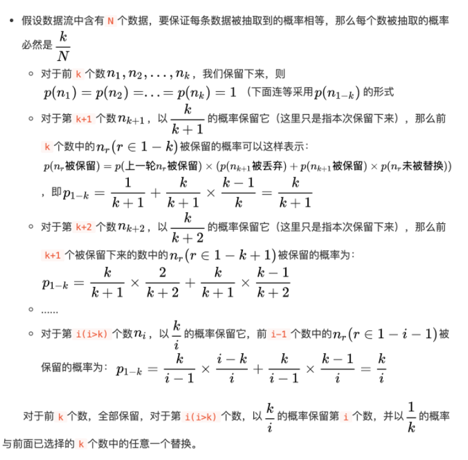

# 蓄水池抽样算法

*Q ： 大数据流中的随机抽样问题    当内存无法加载到全部数据时 如何从包含未知大小的数据流中随机选取K个数据 并保证每个数据被抽取到的概率相等*

*当 K = 1时*

> 也就是我们每次只能读一个数据
>
> 假设数据流含有N个数   我们如果要保证所有的数被抽到的概率相等  那么每个数抽到的概率应该为1/N

> 每次只保留一个数   当遇到第 i 个数时  以 1/i的概率保留它  (i - 1)/i的概率保留原来的数
>
> 例如：
>
> 遇到1 概率为1  保留第一个数
>
> 遇到2 概率为1/2  这个时候  1和2各有1/2的概率被保留
>
> 遇到3  3被保留的概率为1/3  假设之前1没被保留   2/3的概率1被保留  此时1被保留的概率为 2/3 * 1/2 = 1/3  
>
> 以此类推

*当 k > 1时*

> 
>
> Leetcode328