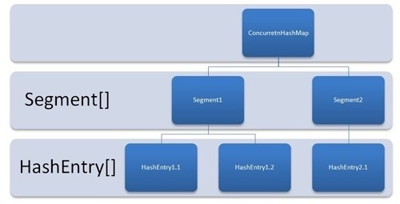
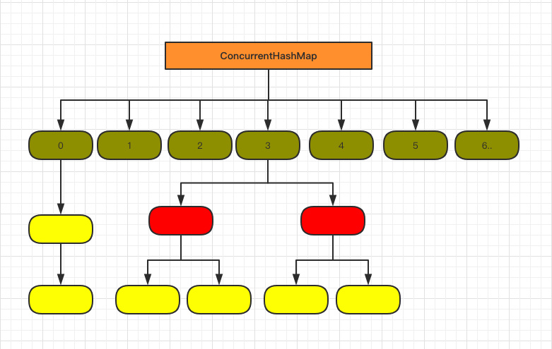

## ConcurrentHashMap

### JDK 1.7
> 结构    由Segment数组、HashEntry组成  数组加链表
> 
> put方法
> 
> 首先通过key定位到Segment 在对应的Segment中进行put
> 先尝试获取锁 如果失败则利用scanAndLockForPut()自旋获取锁 如果重试的次数达到了 MAX_SCAN_RETRIES 则改为阻塞锁获取，保证能获取成功
> 将当前 Segment 中的 table 通过 key 的 hashcode 定位到 HashEntry。
遍历该 HashEntry，如果不为空则判断传入的 key 和当前遍历的 key 是否相等，相等则覆盖旧的 value。
不为空则需要新建一个 HashEntry 并加入到 Segment 中，同时会先判断是否需要扩容。 最后释放锁
>
> get 方法
> 将key通过Hash之后定位具体的Segment 在通过一次hash定位到具体元素 由于Value是volatile的 保证每次获取都是最新值 不需要加锁

### JDK 1.8
> 采用了 CAS + synchronized 来保证并发安全性
> 