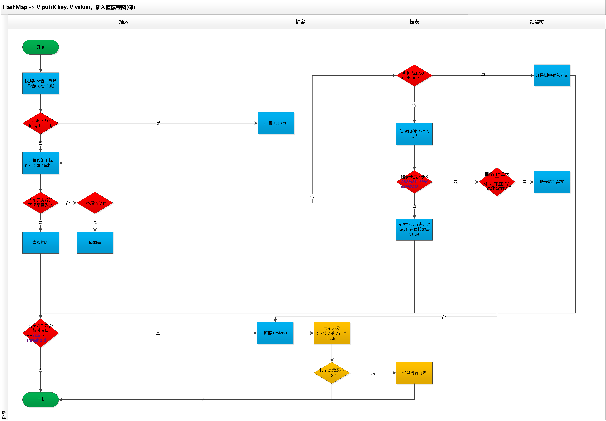

## Java基础

### Java语言三大特性
> 封装 继承 多态

### Java基本数据类型
> byte short int long float double boolean char
> 

### String StringBuffer StringBuilder区别
> String是不可变的 如果尝试修改 会生成一个新的String字符串
> StringBuilder没有加锁 线程不安全  效率会更高
> 
### ArrayList 和 LinkedList区别
> 都实现了List接口 LinkedList 额外实现了Deque接口 是一个双端队列
> ArrayList底层是数组 查询快   LinkedList底层是链表  写入删除快
> 
### CopyOnWriteArrayList
> 线程安全 写操作会加锁   写操作结束之后会把原数组指向新数组
> 内部通过数组实现   
> 添加元素时  会复制一个新的数组 写操作在新的数组上进行 读操作在原数组上进行
> 允许在写操作时来读取数据 提高读的性能  适合读多写少的应用场景 但是比较占内存 同时可能读到的数据不是实时最新的数据 不适合实时性要求很高的场景

### HashMap的扩容机制原理
> 1.7版本 : 生成新数组; 遍历老数组中的每个位置上的链表上的每个元素; 取每个元素的key 并基于新数组长度 计算出每个元素在新数组中的下标; 将元素添加到新数组去; 所有元素转移完了之后 将新数组赋值给HashMap对象的table属性
> 1.8版本: 生成新数组; 遍历老数组中每个位置上的链表或红黑树; 如果是链表,则直接将链表每个元素重新计算下标,并添加到新数组去.如果是红黑树 则先遍历红黑树,先计算出红黑树中每个元素对应在新数组中的下标位置:a.统计每个下标位置的元素个数  b.如果该位置的元素个数超过了8 生成一个新的红黑树 并将跟节点添加到新数组的对应位置 c.如果该位置下的元素个数没有超过8,则生成一个链表,并将链表的头节点添加到新数组对应的位置; 所有元素转移完了之后,将新数组赋值给HashMap的table属性
> 
### ConcurrentHashMap的扩容机制
> 1.7版本: 基于Segment分段实现 每个Segment相当于一个小型的HashMap  每个Segment内部会进行扩容 和HashMap扩容逻辑类似  先生成新的数组 然后转移元素到新数组中 扩容的判断也是每个Segment内部单独判断的
> 1.8版本: 当某个线程进行put时 如果发现正在扩容 那么该线程一起进行扩容  如果某个线程put时 发现没有正在进行扩容 则将key-value添加到map中 判断是否炒锅阈值 超过则扩容; 支持多个线程同时扩容   在转移元素时 现将原数组分组 将每组分给不同的线程来进行元素的转移 每个线程负责一组或多组元素的转移工作

### Java中的四种引用
> 强软弱虚
> 
> 强引用 : 最普遍 例如 String s = "abc"  只要强引用存在 则垃圾回收器就不会回收这个对象
> 
> 软引用 : 用于描述还有用但非必要的对象 如果内存足够 不回收 如果内存不足 则回收
> 
> 弱引用 : 只有弱引用的对象拥有更短的生命周期  发现只具有弱引用的对象,不管当前内存空间足够与否 都会回收
> 
> 虚引用 : 一个对象仅持有虚引用 那么它就和没有任何引用一样 在任何时候都可能被回收 主要用来跟踪对象被垃圾回收器回收的活动
> 
### HashMap源码分析
> HaspMap put流程图

### HashSet的实现原理
> HashSet基于HashMap实现

### 常见的RuntimeException
> NullPointerException    NumberFormatException    IndexOutOfBoundsException    IllegalArgumentException    ClaasCastException. etc

### Java反射
> 指在程序运行状态中 可以构造任意一个类的对象 可以了解任意一个对象所属的类 成员变量 方法 可以调用任意一个对象的属性和方法

### IO NIO
> 阻塞IO 非阻塞IO 多路复用IO 信号驱动IO 异步IO
> NIO的核心组件  channel  buffer  selector
> 
### 零拷贝是什么
> 零拷贝指的是  应用程序在需要把内核中的一块区域数据转移到另一块内核区域去时 不需要经过先复制到用户空间再转移到目标内核区域去了  而直接实现转移