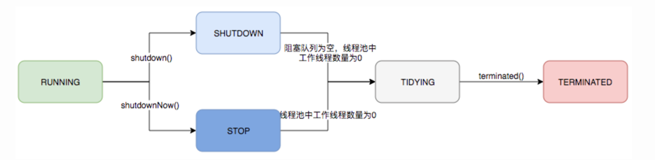
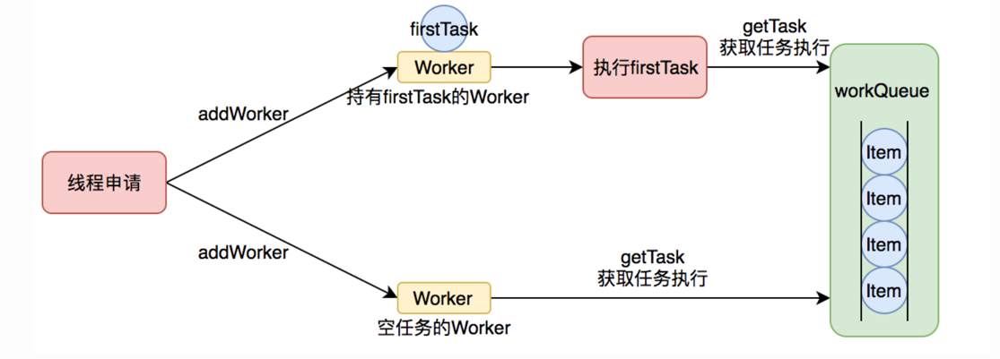

# ThreadPool

_线程池是一种基于池化思想管理线程的工具，通过线程池维护多个线程，等待监督管理者分配可并发执行的任务 避免了处理任务创建销毁线程开销的代价 也避免了线程数量膨胀导致的过分调度的问题 保证对内核的充分利用_

_线程池解决的核心问题是资源管理问题  采用 池化思想  为了最大化收益并最小化风险 将资源统一在一起管理_

## 生命周期管理

*线程池内部使用一个变量来维护两个值  运行状态(runState) 和 线程数量(workerCount)*

> ```java
> private final AtomicInteger ctl = new AtomicInteger(ctlOf(RUNNING, 0));
> ```

_ctl 是对线程池运行状态和线程池中有效线程数量进行控制。高3位保存runState 低29为保存workerCount_

**运行状态有5种， RUNNING：能接受新提交的任务，并且也能处理阻塞队列中的任务；SHUTDOWN：关闭状态，不再接受新提交的任务，却可以继续处理阻塞队列中已保存的任务；STOP：不能接受新任务，也不处理队列中的任务，会中断正在处理任务的线程；TIDYING：所有任务都已经终止，wokerCount为0；TERMINATED：terminated()方法执行完成后进入该状态**




## 任务执行机制

### 任务调度

*首先 所有任务调度都是由execute方法完成的：检查现在线程池的运行状态、运行线程数、运行策略，决定接下来执行的流程，是直接申请线程执行，或是缓冲到队列中执行，亦或是直接拒绝任务*

> 1.检查线程池运行状态，如果不是RUNNING 则直接拒绝
>
> 2.workerCount < corePoolSize 则创建并启动一个线程来执行新提交的任务
>
> 3.workerCount >= corePoolSize 且线程池内的阻塞队列未满 则将新任务添加到该阻塞队列中
>
> 4.workerCount >= corePoolSize && workerCount < maximumPoolSize 且线程池内阻塞队列已满 则创建并启动一个新的线程来执行新提交的任务
>
> 5.workerCount >= maximumPoolSize 且线程池内阻塞队列已满 则根据拒绝策略来处理该任务 默认方式是直接抛出异常

```java
public void execute(Runnable command) {
    if (command == null)
        throw new NullPointerException();
    /*
     * Proceed in 3 steps:
     *
     * 1. If fewer than corePoolSize threads are running, try to
     * start a new thread with the given command as its first
     * task.  The call to addWorker atomically checks runState and
     * workerCount, and so prevents false alarms that would add
     * threads when it shouldn't, by returning false.
     *
     * 2. If a task can be successfully queued, then we still need
     * to double-check whether we should have added a thread
     * (because existing ones died since last checking) or that
     * the pool shut down since entry into this method. So we
     * recheck state and if necessary roll back the enqueuing if
     * stopped, or start a new thread if there are none.
     *
     * 3. If we cannot queue task, then we try to add a new
     * thread.  If it fails, we know we are shut down or saturated
     * and so reject the task.
     */
    int c = ctl.get();
    if (workerCountOf(c) < corePoolSize) {
        if (addWorker(command, true))
            return;
        c = ctl.get();
    }
    if (isRunning(c) && workQueue.offer(command)) {
        int recheck = ctl.get();
        if (! isRunning(recheck) && remove(command))
            reject(command);
        else if (workerCountOf(recheck) == 0)
            addWorker(null, false);
    }
    else if (!addWorker(command, false))
        reject(command);
}
```

### 任务缓冲

*线程池的本质是对任务和线程的管理。关键在于将任务和线程两者解耦  线程池中以生产者消费者模式 通过一个阻塞队列来实现。阻塞队列缓冲任务 工作线程从阻塞队列中获取任务*

### 任务申请

*任务执行有两种可能：1.任务直接由新创建的线程执行 2.线程从任务队列中获取任务然后执行，执行完任务的线程会再次从队列中申请任务再去执行 第二种是线程获取任务绝大多数情况*

> 1.申请任务。获取线程池状态及线程数量
>
> 2.若线程池已经停止运行 则返回null并结束
>
> 3.否则判断线程数现阶段是否过多。若线程数过多 返回null并结束
>
> 4.线程数不多情况下 判断该线程是否为可回收线程 若是，则限时获取任务 否则阻塞获取任务

```java
private Runnable getTask() {
    boolean timedOut = false; // Did the last poll() time out?

    for (;;) {
        int c = ctl.get();
        int rs = runStateOf(c);

        // Check if queue empty only if necessary.
        if (rs >= SHUTDOWN && (rs >= STOP || workQueue.isEmpty())) {
            decrementWorkerCount();
            return null;
        }

        int wc = workerCountOf(c);

        // Are workers subject to culling?
        boolean timed = allowCoreThreadTimeOut || wc > corePoolSize;

        if ((wc > maximumPoolSize || (timed && timedOut))
            && (wc > 1 || workQueue.isEmpty())) {
            if (compareAndDecrementWorkerCount(c))
                return null;
            continue;
        }

        try {
            Runnable r = timed ?
                workQueue.poll(keepAliveTime, TimeUnit.NANOSECONDS) :
                workQueue.take();
            if (r != null)
                return r;
            timedOut = true;
        } catch (InterruptedException retry) {
            timedOut = false;
        }
    }
}
```

*getTask进行了多次判断 为了控制线程数量 使其更符合线程池的状态 如果线程池现在不应该持有那么多线程 则会返回null。 工作线程Worker会不断接收新的任务去执行 而当工作线程Worker接收不到任务的时候 就会开始被回收*

### 任务拒绝

``` void rejectedExecution(Runnable r, ThreadPoolExecutor executor);```

*JDK提供了四种拒绝测了*

> 1.ThreadPoolExecutor.AbortPolicy ：丢弃并抛出RejectedExecutionException 默认拒绝策略
>
> 2.ThreadPoolExecutor.DiscardPolicy ： 丢弃任务 但不抛出异常
>
> 3.ThreadPoolExecutor.DiscardOldestPolicy ：丢弃队列最前面的任务 然后重新提交被拒绝的任务
>
> 4.ThreadPoolExecutor.CallerRunsPolicy ：调用线程处理该任务

## Worker线程管理

### worker线程

*工作线程worker 实现Runnable接口 并持有一个线程thread 一个初始化任务firstTask。thread在调用构造方法时通过ThreadFactory来创建线程 可以用来执行任务；firstTask用它来保存传入的第一个任务 这个任务可以为null。如果这个值非空 那么线程就会在启动初期立即执行这个任务，也就是对应核心线程创建时的情况；如果是null 那么久需要创建一个线程去执行任务列表(workQueue)中的任务 也就是非核心线程的创建*



*线程池使用一张Hash表持有线程的引用 来控制线程的生命周期 最重要的就是如何判断线程是否在运行*

*Worker通过继承AQS 使用AQS来实现独占锁  实现不可重入的特性去反应线程现在的执行状态*

> 1.lock方法一旦获取了独占锁 表示当前线程正在执行任务中
>
> 2.如果正在执行任务 则不应该中断线程
>
> 3.如果该线程现在不是独占锁的状态 也就是空闲状态 说明它没有在处理任务 这时候可以对线程进行中断
>
> 4.线程池在执行shutdown方法或tryTerminate方法时会调用interruptdleWorkers方法来中断空闲的线程 使用tryLock方法来判断线程池中是否是空闲状态 若果空闲则可以安全回收

### worker线程增加

*addWorker方法*

```java
/**
 * Checks if a new worker can be added with respect to current
 * pool state and the given bound (either core or maximum). If so,
 * the worker count is adjusted accordingly, and, if possible, a
 * new worker is created and started, running firstTask as its
 * first task. This method returns false if the pool is stopped or
 * eligible to shut down. It also returns false if the thread
 * factory fails to create a thread when asked.  If the thread
 * creation fails, either due to the thread factory returning
 * null, or due to an exception (typically OutOfMemoryError in
 * Thread.start()), we roll back cleanly.
 *
 * @param firstTask the task the new thread should run first (or
 * null if none). Workers are created with an initial first task
 * (in method execute()) to bypass queuing when there are fewer
 * than corePoolSize threads (in which case we always start one),
 * or when the queue is full (in which case we must bypass queue).
 * Initially idle threads are usually created via
 * prestartCoreThread or to replace other dying workers.
 *
 * @param core if true use corePoolSize as bound, else
 * maximumPoolSize. (A boolean indicator is used here rather than a
 * value to ensure reads of fresh values after checking other pool
 * state).
 * @return true if successful
 */
private boolean addWorker(Runnable firstTask, boolean core) {
    retry:
    for (;;) {
        int c = ctl.get();
        int rs = runStateOf(c);

        // Check if queue empty only if necessary.
        if (rs >= SHUTDOWN &&
            ! (rs == SHUTDOWN &&
               firstTask == null &&
               ! workQueue.isEmpty()))
            return false;

        for (;;) {
            int wc = workerCountOf(c);
            if (wc >= CAPACITY ||
                wc >= (core ? corePoolSize : maximumPoolSize))
                return false;
            if (compareAndIncrementWorkerCount(c))
                break retry;
            c = ctl.get();  // Re-read ctl
            if (runStateOf(c) != rs)
                continue retry;
            // else CAS failed due to workerCount change; retry inner loop
        }
    }

    boolean workerStarted = false;
    boolean workerAdded = false;
    Worker w = null;
    try {
        w = new Worker(firstTask);
        final Thread t = w.thread;
        if (t != null) {
            final ReentrantLock mainLock = this.mainLock;
            mainLock.lock();
            try {
                // Recheck while holding lock.
                // Back out on ThreadFactory failure or if
                // shut down before lock acquired.
                int rs = runStateOf(ctl.get());

                if (rs < SHUTDOWN ||
                    (rs == SHUTDOWN && firstTask == null)) {
                    if (t.isAlive()) // precheck that t is startable
                        throw new IllegalThreadStateException();
                    workers.add(w);
                    int s = workers.size();
                    if (s > largestPoolSize)
                        largestPoolSize = s;
                    workerAdded = true;
                }
            } finally {
                mainLock.unlock();
            }
            if (workerAdded) {
                t.start();
                workerStarted = true;
            }
        }
    } finally {
        if (! workerStarted)
            addWorkerFailed(w);
    }
    return workerStarted;
}
```

### worker线程回收

*线程池中的线程销毁依赖JVM自动回收 线程池根据当前线程池状态维护一定数量的线程引用 防止被JVM回收*

> processWorkerExit方法

### Worker线程执行任务

> runWorker方法

*1.while循环不断通过getTask方法获取任务  2.getTask方法从阻塞队列中获取任务 3.如果线程池正在停止 那么要保证当前线程是中断状态 否则要保证当前线程不是中断状态 4.执行任务 5.如果getTask结果为null则跳出循环 执行processWorkerExit方法 销毁线程*