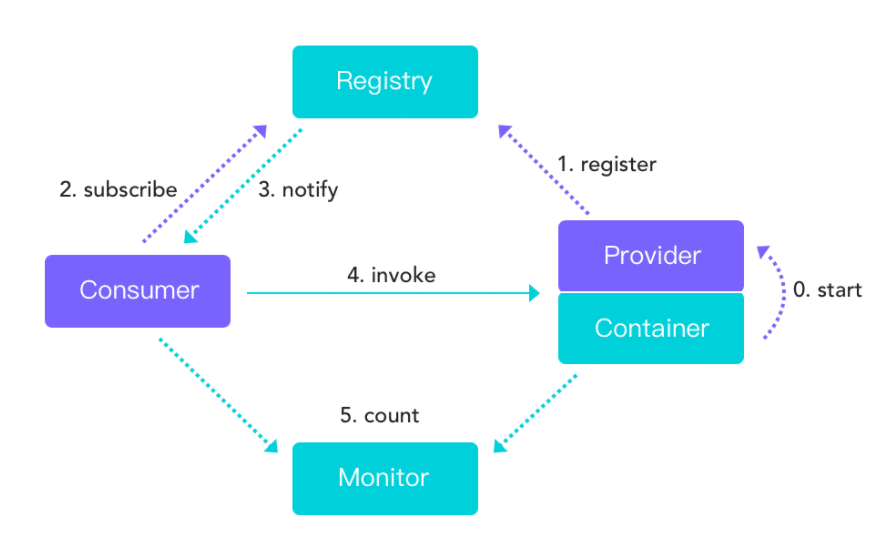

## Dubbo

### RPC  远程过程调用

### dubbo

一次完整的RPC调用流程（同步调用）：

1.服务消费方以本地调用方式调用服务

2.Client stub 接收到调用后 负责将方法、参数等组装成能够进行网络传输的消息体

3.client stub 找到服务地址 并将消息发送到服务端

4.server stub 接收到消息后进行解码

5.server stub根据解码结果调用本地的服务

6.本地服务执行并将结果返回给server stub

7.server stub将返回结果打包成消息并发送给消费方

8.client stub成功收到消息 并进行解码

9.服务消费方得到最终结果

### dubbo 通信 Netty 

### Dubbo架构设计
> Proxy服务代理层
> Registry注册中心层
> Protocol远程调用层
> Transport网络传输层
> Serialize数据序列化层

### Dubbo是如何完成服务导出的
> 首先dubbo会将@DubboService注解或@Service注解进行解析得到所定义的服务参数 包括定义 服务名 服务接口 服务超时时间 服务协议等等  得到一个ServiceBean
> 调用ServiceBean的export方法进行服务导出
> 然后将服务信息注册到注册中心 如果有多个协议 多个注册中心 就将服务按单个协议 单个注册中心进行注册
> 将服务信息注册到注册中心后 还会绑定一些监听器 监听动态配置中心的变更
> 还会根据服务协议启动对应的Web服务器或网络框架 比如 Tomcat Netty等
> 
### Dubbo是如何完成服务引入的
> 使用@Reference注解来引入一个服务时  Dubbo会将注解和服务的信息解析出来 得到当前所引用的服务名 服务接口等
> 从注册中心进行查询服务信息  得到服务的提供者信息 并存在消费端服务目录中
> 并绑定一些监听器来监听动态配置中心的变更
> 然后根据查询得到的服务提供者信息生成一个服务接口代理对象  放入Spring容器中作为Bean
> 
> 
### Dubbo支持哪些负载均衡策略
> 1.随机  从多个服务提供者随机选择一个来处理本次请求 支持按权重设置随机概率
> 2.轮询  一次选择服务提供者来处理请求 并支持按权重进行轮询 底层采用 平滑加权轮询算法
> 3.最小活跃调用数 : 统计服务提供者正在处理的请求 下次请求过来则交给活跃数最小的服务器来处理
> 4.一致性哈希 : 相同参数的请求总是发到同一个服务提供者

