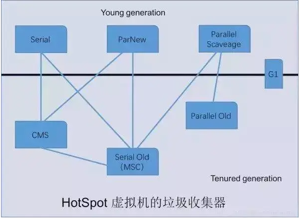
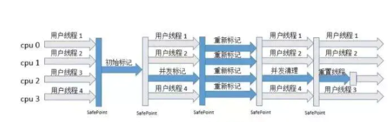

# 7中垃圾回收特点 优劣及适用场景

## 常见垃圾收集器

### 新生代收集器

>1.Serial
>
>2.ParNew
>
>3.Parallel

### 老年代收集器

> 1.Serial Old
>
> 2.CMS
>
> 3.Parallel Old

### 新生代和老年代收集器

> G1

## 新生代垃圾收集器

### Serial

*采用 复制算法 进行垃圾收集 串行回收 当应用程序进行到一个安全点时 所有线程全部暂停 等待GC完成后 继续执行*

*优势 : 简单高效  由于采用单线程方法 对单个CPU来说没有上下文之间的切换 效率比较高*

*缺点 : 会在用户不知道的情况下停止所有工作线程 用户体验差*

*适用场景 : Client模式(桌面应用); 单核服务器*

### ParNew

*Serial的多线程版本*

*优势 : 随着CPU的有效利用 对于GC时系统资源有效利用有好处*

*缺点 : 同Serial*

*适用场景 : Server模式下虚拟机首选的新生代收集器  CMS只能与Serial或ParNew联合适用  在多核系统环境下 首选ParNew与CMS配合 是适用CMS收集器后默认的新生代收集器*

### Parallel Scavenge

*采用 复制算法  与ParNew不同之处在于其目的是达到一个可控制的吞吐量 而 ParNew收集器关注点在于尽可能缩短STW  吞吐量指的是 CPU用于运行用户代码的时间与CPU总消耗时间的比值*

*优势 : 追求高吞吐量 高效利用CPU 吞吐量优先且能精确控制*

*适用场景 : 注重吞吐量高效利用的CPU 需要高效运算 且不需要太多交互*

## 老年代垃圾收集器

### Serial Old

*是Serial收集器老年版本 同样是一个单线程收集器 使用 标记整理 算法*

*适用场景 : Client模式; 单核服务器; 作为CMS收集器的后备方案 在发生Concurrent Mode Failure时使用*

### Parallel Old

*是Parallel Scavenge老年代版本  使用多线程 标记整理 算法  充分利用多核CPU计算能力*

*适用场景 : 注重吞吐量与CPU资源敏感的场合 jdk7和jdk8默认*

### CMS

*是一种以获取最短回收停顿时间为目标的收集器  采用  标记清除 算法 运作过程分为4个步骤*

> 1.初始标记 : 标记GC Roots 能够直接关联达到对象
>
> 2.并发标记 : 进行GC Roots Tracing的过程
>
> 3.重新标记 : 修正并发标记期间因用户程序继续运作而导致标记产生变动的那一部分标记
>
> 4.并发清除

*初始标记和重新标记仍然需要STW*

*优点 : 并发收集 低停顿*

*缺点 : 1.CMS收集器对CPU资源敏感  默认回收的线程数是 (CPU数量 + 3) / 4   当CPU在4个以上时 并发回收时垃圾收集线程不少于25% 并随着CPU数量的增加而下降  但CPU不足4个时候 对用户影响较大;  2.CMS无法处理浮动垃圾 可能会出现 Concurrent Mode Failure 失败而到时一次FullGC的产生  3.因为采用标记清除算法  会产生空间碎片*

*适用场景 : 重视服务器响应速度 要求系统停顿时间最短*

## 新生代和老年代垃圾收集器

### G1

*面向服务端应用的垃圾收集器  JDK9默认垃圾收集器*

> 1.并行与并发 : G1能充分利用多CPU 多核环境下的硬件优势
>
> 2.分代收集 : 能够采用不同的方式去处理新创建的对象和已存货了一段时间的对象  不需要与其他收集器进行合作
>
> 3.空间整合 : G1从整体上来看 基于 标记整理 算法  从局部看是基于 标记复制 算法 不会产生空间碎片
>
> 4.可预测的停顿 : 能够建立可预测的时间停顿模型

*适用场景 : 要求尽可能可控的GC停顿时间; 内存占用较大的应用*

