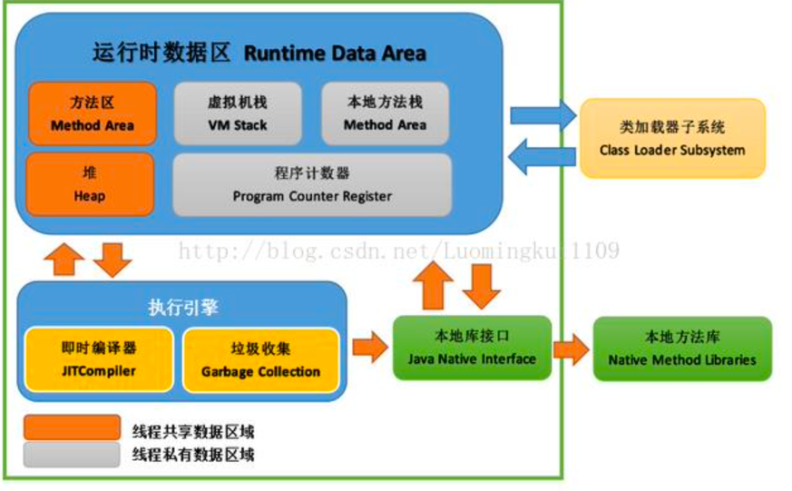

#JVM

### JVM中那些可以作为GC root
> 栈中的本地变量  方法区中的静态变量   本地方法栈中的变量  正在运行的线程
> 
### JVM中哪些是线程共享的
> 堆区和方法区是所有线程共享的   栈 本地方法栈  程序计数器是每个线程独有的
> 
> 
### 类加载器双亲委派模型
> JVM中存在三个默认的类加载器 :  BootstrapClassLoader  ExtClassLoader  APPClassLoader
> APPClassLoader的父加载器是ExtClassLoader  ExtClassLoader的父加载器是BootstrapClassLoader
> JVM在加载一个类时, 会调用APPClassLoader的loadClass方法来加载这个类 不过在这个方法中 会先使用ExtClassLoader的loadClass方法来加载类  同样ExtClassLoader的loadClass方法会先使用BootstrapClassLoader来加载类, 如果BootstrapClassLoader加载到了就直接成功 没有加载到 那么ExtClassLoader尝试加载 如果没有加载到 APPClassLoader来加载这个类
> 所以 双亲委派指的是 JVM在加载类时 会委派给Ext和Bootstrap进行加载 如果没有加载到才由自己进行加载

## 程序计数器 （线程私有）
> 一块较小的内存空间  可以看作当前线程所执行的字节码的行号指示器  没有任何OutOfMemoryError情况
> 
## 虚拟机栈 （线程私有）
> 描述Java方法执行的内存模型 ：每个方法在执行的同时会创建一个栈帧 用于存储局部变量表、操作数栈、动态链接、方法出口等信息。 每一个方法从调用直到执行完成的过程 就对应着一个栈帧在虚拟机栈中从入栈到出栈的过程
> 如果线程请求的栈深度大于虚拟机所允许的深度 抛出StackOverflowError；如果虚拟机栈可扩展 当扩展无法申请到足够的内存 会抛出OutOfMemoryError异常
> 
## 本地方法栈