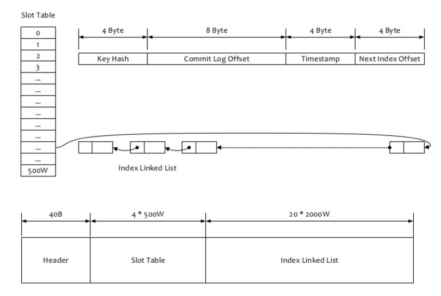

# RocketMQ

## 消息存储

### 整体架构

> 1.CommitLog 
>
> 消息主体以及元数据的存储主体   存储Producer端写入的消息主体内容  消息内容不是定长的  单个文件默认大小是1G, 文件名长度20位,左边补0,剩余为起始偏移量.消息主要是顺序写入日志文件,当文件满了,写入下一个文件

> 2.ConsumeQueue
>
> 消息消费队列  引入目的主要是提高消息消费的性能. RocketMQ是基于topic订阅的 消息消费是针对主题进行的,如果要遍历commitLog文件中根据topic检索消息 效率非常低.Consumer根据ConsumeQueue来查找待消费的消息,其中 ConsumeQueue(逻辑消费队列)作为消费消息的索引,保存了指定Topic下的队列消息在CommitLog中的起始物理偏移量offset,消息大小size和 消息Tag的HashCode.ConsumeQueue文件可以看作是基于topic的CommitLog索引文件 . ConsumeQueue文件采取定长设计,一共20个字节 ,分别为: 8个字节的CommitLog物理偏移量;4个字节地消息长度;8个字节的tag HashCode

> 3.IndexFile  提供了一种可以通过key或时间区间来查询消息的方法   固定每个IndexFile为400M    底层存储设计为 在文件系统中实现HashMap结构

> RocketMQ采用混合型存储结构,即 为Broker单个实例下所有的队列共用一个日志数据文件(CommitLog)来存储.

### 页缓存与内存映射

> 页缓存是OS对文件的缓存  用于加速对文件的读写. 一般来说  程序对文件进行顺序读写的速度几乎接近于内存的读写速度,主要原因就是因为OS使用PageCache机制对读写访问操作进行了性能优化,将一部分的内存用做PageCache.对于数据的写入,OS先写到Cache内,随后通过异步的方式由内核线程将Cache内的数据刷盘到物理磁盘上.  对于数据的读取,如果一次读取文件时出现未命中PageCache的情况,OS从物理磁盘上访问读取文件的同时,会顺序对其他相邻块的数据进行预读取

> 在RocketMQ中 consumeQueue逻辑消费队列存储的数据较少,并且是顺序读取 在page cache机制的预读取作用下, ConsumeQueue文件的读性能几乎接近读内存. 即使在有消息堆积的情况下也不会影响性能. 对于CommitLog消息存储的日志数据文件来说,读取消息内容时候会产生比较多的随机访问读取,严重影响性能.采用合适的IO调度算法 比如块存储采用SSD的话 使用Deadline算法  随机读的性能也会有所提升

> RocketMQ主要通过MappedByteBuffer对文件进行读写操作, 利用NIO中的FileChannel模型将磁盘上的物理文件直接映射到用户态的内存地址中(这种Mmap的方式减少了传统IO将磁盘文件数据在操作系统内核地址空间的缓冲区和用户应用程序地址空间的缓冲区之间来回进行拷贝的性能开销).将对文件的操作转化为直接对内存地址进行操作,从而极大提高了文件的读写效率

### 消息刷盘

#### 同步刷盘

> 只有在消息真正持久化到磁盘后RocketMQ的Broker端才会真正返回给Producer端一个成功的ACK响应.同步刷盘对MQ消息可靠性来说是一种不错的保障  但是性能有比较大的影响

#### 异步刷盘

> 充分利用OS的PageCache优势  只要消息写入PageCache即可将成功的ACK返回给Producer. 消息刷盘采用后台异步线程提交的方式进行,降低读写延迟 提高了MQ的性能和吞吐量

## 通信机制

*RocketMQ消息队列集群主要包括NameServer. Broker(Master/Slave). Producer. Consumer4个角色*

> 1.Broker启动后需要完成一次将自己注册到NameServer的操作,随后每30秒定时向NameServer上报Topic路由信息
>
> 2.Producer作为客户端发送消息的时候, 需要根据消息的Topic从本地缓存的TopicPublishInfoTable获取路由信息. 如果没有则更新路由信息会从NameServer上重新拉取, 同时Producer会默认每隔30S向NameServer拉取一次路由信息
>
> 3.Producer根据2中获取的路由信息选择一个队列(MessageQueue)进行消息发送; Broker作为消息的接收者接收消息并落盘存储
>
> 4.Consumer根据2中获取的路由信息,并在完成客户端的负载均衡后,选择其中一个或者某几个消息队列来拉取消息并进行消费

### 消息的通信方式

*RocketMQ消息队列中支持通信的方式主要有  同步(sync). 异步(async). 单向(oneway)*

## 消息过滤

> RocketMQ分布式消息队列的消息过滤方式有别于其他MQ中间件, 实在Consumer端订阅消息时再做消息过滤的. RocketMQ这么做是在于其Producer端写入消息和Consumer端订阅消息采用分离存储机制来实现的 . Consumer端订阅消息需要通过ConsumeQueue这个消息消费的逻辑队列拿到一个索引  然后再从CommitLog里面读取真正的消息实体内容 .
>
> 

> 1.Tag过滤方式
>
> Consumer端在订阅消息时除了指定Topic还可以指定Tag, 如果一个消息有多个Tag,用||分隔. 其中 Consumer端会将这些订阅请求构成一个SubscriptionData 发一个Pull消息的请求给Broker. Broker从RocketMQ的文件存储层(Store)读取数据之前, 会用这些数据先构建一个MessageFilter, 再传给Store. Store从ConsumeQueue读取到一条记录后,会用它记录消息的Tag hash值去做过滤, 由于服务端只根据hashcode进行判断,无法精确对tag原始字符串进行过滤  所以在消费端拉取到消息后  还需要对原始tag字符串进行比对 如果不同 则丢弃该消息 不进行消费

> 2.SQL92过滤方式
>
> 和Tag大致一样 只是在Store层具体过滤过程不一样  真正的SQL Expression的构建和执行由RocketMQ-filter模块负责. 每次过滤都要执行SQL表达式会影响效率  所以RocketMQ使用了BloomFilter避免每次去执行.SQL92的表达式上下文为消息的属性.

## 负载均衡

### Producer的负载均衡

> Producer端在发送消息的时候, 会先根据Topic找到指定的TopicPublishInfo, 在获取了TopicPublishInfo路由信息后,RocketMQ的客户端在默认方式下 selectOneMessageQueue()方法会从TopicPublishInfo中的messageQueueList中选择一个队列进行发送消息.
>
> 具体容错策略在MQFaultStrategy类中定义  有一个sendLatencyFaultEnable开关变量.如果开启 在随机递增模的基础上,再过滤掉not available的Broker代理.latencyFaultTolerance 指对之前失败的 按一定时间做逼退. 比如 上次请求的latency超过550Lms 就退避3000Lms;   如果关闭 采用随机递增取模的方式选择一个队列来发送消息

### Consumer的负载均衡

*在RocketMQ中 Consumer端的两种消费模式(Push/Pull)都是基于拉模式来获取消息的  而在Push模式只是对Pull模式的一种封装  其本质实现为消息拉取线程从服务器拉取到一批消息后, 然后提交到消息消费线程池后, 又继续向服务器再次尝试拉取消息  如果未拉取到消息 则延迟一下又继续拉取.*

*两种拉取模式的消费方式  均需要Consumer端知道从Broker端的哪一个消息队列中去拉取消息  因此  有必要在Consumer端来做负载均衡. 即Broker端中多个MessageQueue分配给同一个ConsumerGroup中的哪些Consumer消费*

> 1.Consumer端的心跳包发送
>
> 在Consumer启动后,就会通过定时任务不断向Broker实例发送心跳(包含  消息消费分组名称   订阅关系集合  消息通信模式  和  客户端Id等)  Broker在收到Consumer的心跳消息后, 将它维护在ConsumerManager的本地缓存变量 consumerTable, 同时并将封装后的客户端网络通道信息保存在本地缓存变量 channelInfoTable中  为之后做Consumer端的负载均衡提供可依据的元数据信息
>
> 2.Consumer端实现负载均衡的核心类  RebalanceImpl
>
> 在Consumer实例启动流程中启动MQClientInstance实例部分  会完成负载均衡服务线程 RebalanceService的启动(每隔20S执行一次).  最终调用rebalanceByTopic()方法. 这里 rebalanceByTopic方法会根据消费者通信类型为"广播模式"还是"集群模式"做不同的处理  

> 集群模式下主要处理流程:
>
> 1.从topicSubscirbeInfoTable中获取Topic主题下的消息消费队列集合(mqSet)
>
> 2.根据topic和consumerGroup为参数调用findConsumerIdList 向Broker端发送获取该消费组下消费者Id列表的RPC通信请求
>
> 3.先对topic下的消息消费队列  消费者Id排序  然后用消费队列分配策略算法(默认为 : 消息队列平均分配算法)  计算出待拉取的消息队列. 这里 平均分配算法 类似于分页的算法  将所有Queue排好序类似于记录  将consumer排好序类似于页数 求出每一页需要包含的平均size和每个页面记录的范围range  最后遍历整个range计算当前consumer应该分配到的记录(queue)
>
> 4.调用updateProcessQueueTableInRebalance  先将分配到的消息队列集合(mqSet)与processQueueTable做一个过滤比对
>
> 最后 为过滤后的消息队列集合(mqSet)中的每个MessageQueue创建一个ProcessQueue对象并存入processQueueTable队列中, 并创建拉取请求对象pullRequest添加到拉取列表pullRequestList中  将Pull消息的请求对象放入服务线程的阻塞队列中  待该服务线程取出后向Broker端发起Pull消息的请求

*消费队列在同一消费组不同消费者之间的负载均衡, 其核心设计理念是  一个队列在同一时间只允许被一个消费组内的一个消费者消费, 一个消息消费者能同时消费多个消息队列*

## 事务消息

*采用2PC的思想来实现事务提交消息 同时增加一个补偿逻辑来处理二阶段超时或者失败的消息*

### 事务消息流程概要

> 事务消息发送及提交
>
> 1.发送消息(half 消息)
>
> 2.服务端响应消息写入结果
>
> 3.根据发送结果执行本地事务(如果写入失败 此时half消息对业务不可见  本地逻辑不执行)
>
> 4.根据本地事务状态执行commit或者Rollback(Commit操作生成消息索引  消息对消费者可见)

> 补偿流程
>
> 1.对没有Commit/Rollback的事务消息(pending状态的消息) 从服务端发起一次"回查"
>
> 2.producer收到回查消息  检查回查消息对应的本地事务状态
>
> 3.根据本地事务状态  重新Commit或者Rollback

*补偿阶段用于解决事务Commit或者Rollback发生超时或者失败的情况*

### RocketMQ事务消息设计

> 1.事务消息在一阶段对用户不可见
>
> 事务消息相对普通消息最大的特点就是一阶段发送的消息对用户是不可见的
>
> RocketMQ事务消息做法 : 如果消息时half消息  将备份原消息主体与消息消费队列  然后改变主题为RMQ_SYS_TRANS_HALF_TOPIC.由于消费组未订阅该主题 消费者无法消费half类型消息. 然后RocketMQ会开启一个定时任务 从Topic为RMQ_SYS_TRANS_HALF_TOPIC中拉取消息进行消费  根据生产者组获取一个服务提供者发送回查事务状态请求 根据事务状态来决定提交或是回滚

> 2.Commit和Rollback操作以及Op消息的引入
>
> 在完成一阶段写入一条对用户不可见的消息后, 二阶段如果是commit操作 则需要让消息对用户可见 : 如果是Rollback则需要撤销一阶段的消息.
>
> 对于Rollback 本身一阶段的消息对用户是不可见的  其实不需要真正撤回消息(实际上也无法真正删除一条消息  因为顺序写文件). 但是区别于这条消息没有确定状态(pending状态) 需要一个操作来标识这条消息的最终状态. RocketMQ事务消息方案中引入了Op消息的概念  用Op消息标识事务消息是否已经确定状态. 如果一条事务消息没有对应Op消息 说明这个状态还无法确定. 引入Op消息后,事务消息无论是Commit还是Rollback都会记录一个Op操作 Commit相对于Rollback只是在写入Op消息前创建Half消息的索引

> 3.Op消息的存储与对应关系
>
> Op消息写入到全局一个特定的Topic中. 这个Topic是内部的Topic 不会被用户消费  Op消息的内容为对应的Half消息的存储的offset 这样Op消息能索引到Half消息进行后续的回查操作

> 4.half消息的索引构建
>
> 在执行二阶段commit操作时, 需要构建出Half消息的索引. 一阶段的Half消息由于是写入到一个特殊的Topic 所以二阶段构建索引时需要读取出Half消息,并将Topic和Queue替换成真正目标的Topic和Queue. 之后通过一次普通消息的写入操作来生成一条对用户可见的消息.所以RocketMQ事务消息二阶段其实是利用了一阶段存储的消息的内容 在二阶段恢复出一条完整的普通消息. 然后走一遍消息写入流程

> 5.如果处理二阶段失败的消息
>
> RocketMQ事务消息的二阶段过程中失败了, 例如做commit操作时 出现网络问题导致commit失败 那么需要通过一定的策略使这条消息最终被commit
>
> 采用了一种补偿机制  称为"回查"  Broker端对未确定状态的消息发起回查,将消息发送到对应的Producer端(同一个Group的Producer), 由Producer根据消息来检查本地事务的状态 进而执行Commit或者Rollback. Broker端通过对比Half消息和Op消息进行事务消息的回查并推进CheckPoint
>
> *rokectmq并不会无休止的信息事务状态回查  默认15次  如果15次回查还是无法得知事务状态  rocketmq默认回滚该消息*

## 消息查询

*RocketMQ支持按照MessageId查询和根据MessageKey查询*

### 按照MessageId查询消息

> RocketMQ中MessageId的长度总共有16字节, 其中包含了消息存储主机地址(IP地址和端口),消息Commit Log Offset.
>
> 按照MessageId查询消息的做法 : Client端从MessageId中解析出Broker的地址(IP地址和端口)和Commit Log偏移地址后 封装成一个RPC请求后 通过Remoting通信层发送.  用commitLog offset和size去commitLog中找到真正的记录并解析成一个完整的消息返回

### 按照Message Key查询消息

> 按照MessageKey查询消息  主要是基于RocketMQ的indexFile索引文件来实现的
>
> 
>
> 如果消息的properties中设置了UNIQ_KEY这个属性  就用topic+#+UNIQ_KEY的value作为key来做些操作  如果设置了KEYS属性 也用这个做索引
>
> 通过Broker业务处理器来查询  读取消息过程就是用topic和key找到indexFile索引文件中的一个记录  根据commitLog offset从CommitLog文件中读取消息实体内容