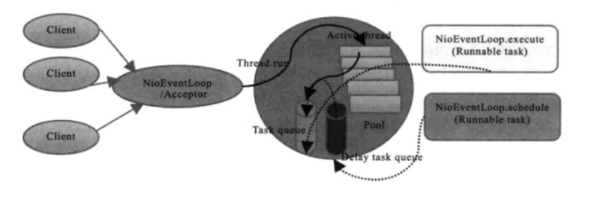

#Netty

## IO
> Java BIO  -- Blocking I/O  同步阻塞I/O模式
> 
> Java NIO  -- New I/O   同步非阻塞模式
> 原来I/O以流的方式处理数据  而NIO以块的方式处理数据
> 面向流的I/O系统一次一个字节地处理数据  一个输入流产生一个字节的数据  一个输出流消费一个字节的数据
> 面向块的I/O系统以块的形式处理数据  每一个操作都在一步中产生或者消费一个数据块. 按块处理比按流处理快得多 但是缺少一些面向流I/O所具有的优雅性和简单性
> 
> Java AIO  -- Asynchronous I/O  异步非阻塞I/O模型
> 在NIO的基础上引入了新的异步通道的概念  并提供了异步文件通道和异步套接字通道实现
> 

### Netty与tomcat区别 特点
> Netty是一个基于NIO的异步网络通信框架 性能高 封装了原生NIO编码的复杂度 
> Tomcat是一个Web服务器 是一个Servlet容器 基本上Tomcat内部只会运行Servlet程序 并处理Http请求 而Netty封装的底层是IO模型 关注的是网络数据的传输 而不是具体的协议 可定制性更高
> 
> 
### Netty的线程模型
> Netty同时支持Reactor单线程模型  Reactor多线程模型 和 Reactor主从多线程模型 可根据启动参数配置在这三种模型之间切换
> 
> 服务端启动时 通常会创建两个NioEventLoopGroup实例  对应了两个独立的Reactor线程池 bossGroup负责处理客户端的连接请求 workerGroup负责处理I/O相关操作 执行系统Task 定时Task等  用户可以根据ServerBootStrap配置参数选择Reactor线程模型 从而最大限度满足用户定制化需求
> 
> 

### Netty高性能体现在哪些方面
> NIO模型
> 内存零拷贝
> 内存池设计  申请的内存可以重用 主要指直接内存  内部实现是用一颗二叉查找树管理内存分配情况
> 串行化处理读写
> 高性能序列化协议  支持protobuf
> 高性能并发编程体现 