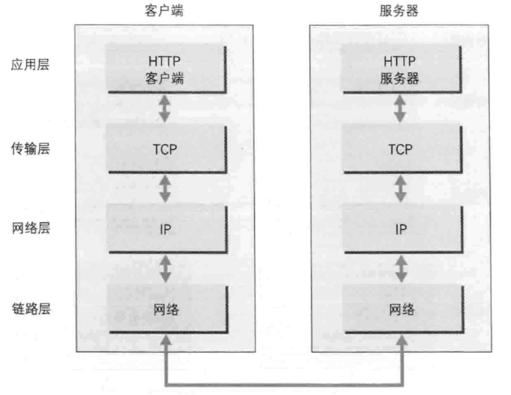
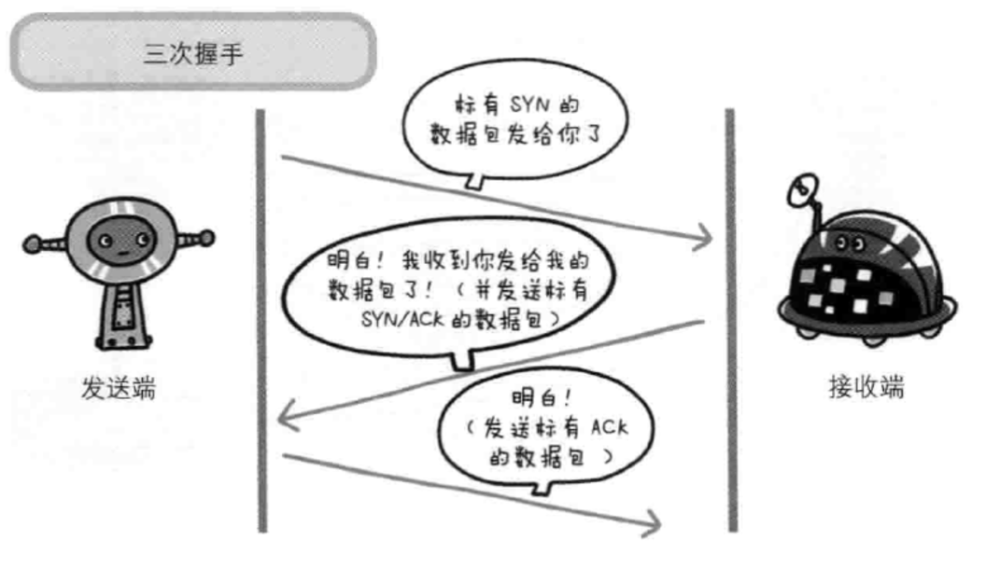

# 网络

### 网络基础
> TCP/IP 通常使用的网络是在TCP/IP协议族的基础上运作的 HTTP属于其内部的一个子集
- TCP/IP最重要的一点就是分层 按层次分为 应用层 传输层 网络层  数据链路层
- 应用层 ：决定了向用户提供应用服务时通信的活动 （FTP、DNS） HTTP协议处于该层
- 传输层 ：提供处于网络链接中两台计算机之间的数据传输 有两个性质不同的协议 TCP（传输控制协议） 和 UDP（用户数据报协议）
- 网络层 ：用来处理在网络上流动的数据包 数据包是网络传输最小的数据单位 该层规定通过怎样的路径到达对方计算机 并把数据包给对方（选择传输路线）
- 数据链路层 ：用来处理链接网络的硬件部分

> TCP/IP通信传输流
> 
- 发送端在层与层之间传输数据时 每经过一层必定会被打上一个该层所属的首部信息 反之则消去首部信息
> 
> 与HTTP相关的协议 IP TCP DNS
- 负责传输的IP协议
- ``` ip协议位于网络层  作用是把各种数据包传送给对方 要确保确实传送到对方那里 需要各种条件 其中最重要的就是IP地址和MAC地址 ```
- 确保可靠性的TCP协议
- ``` TCP位于传输层 提供可靠的字节流服务（大块数据分割成以报文段为单位的数据包进行管理） 能够把数据准确可靠的传给对方 为了确保准确 TCP协议采用三次握手策略 ```
- #### 三次握手
- 发送端首先发送一个带SYN标志的数据包给对方 接收端收到后 回传一个带有SYN/ACK标志的数据包以示传达确认信息 最后发送端再回传一个带ACK标志的数据包 以表握手结束 若在握手过程中某个阶段中断 TCP协议会再次以相同顺序发送相同数据包
- 

> 负责域名解析的DNS服务
> - DNS位于应用层 提供域名到IP地址的解析服务