# 网络

### 网络基础
> TCP/IP 通常使用的网络是在TCP/IP协议族的基础上运作的 HTTP属于其内部的一个子集
- TCP/IP最重要的一点就是分层 按层次分为 应用层 传输层 网络层  数据链路层
- 应用层 ：决定了向用户提供应用服务时通信的活动 （FTP、DNS） HTTP协议处于该层
- 传输层 ：提供处于网络链接中两台计算机之间的数据传输 有两个性质不同的协议 TCP（传输控制协议） 和 UDP（用户数据报协议）
- 网络层 ：用来处理在网络上流动的数据包 数据包是网络传输最小的数据单位 该层规定通过怎样的路径到达对方计算机 并把数据包给对方（选择传输路线）
- 数据链路层 ：用来处理链接网络的硬件部分

> TCP/IP通信传输流
> 
- 发送端在层与层之间传输数据时 每经过一层必定会被打上一个该层所属的首部信息 反之则消去首部信息
> 
> 与HTTP相关的协议 IP TCP DNS
- 负责传输的IP协议
- ``` ip协议位于网络层  作用是把各种数据包传送给对方 要确保确实传送到对方那里 需要各种条件 其中最重要的就是IP地址和MAC地址 ```
- 确保可靠性的TCP协议
- ``` TCP位于传输层 提供可靠的字节流服务（大块数据分割成以报文段为单位的数据包进行管理） 能够把数据准确可靠的传给对方 为了确保准确 TCP协议采用三次握手策略 ```
- #### 三次握手
- 发送端首先发送一个带SYN标志的数据包给对方 接收端收到后 回传一个带有SYN/ACK标志的数据包以示传达确认信息 最后发送端再回传一个带ACK标志的数据包 以表握手结束 若在握手过程中某个阶段中断 TCP协议会再次以相同顺序发送相同数据包
- 

> 负责域名解析的DNS服务
> - DNS位于应用层 提供域名到IP地址的解析服务
> 
> 
### 端到端的通信是应用进程之间的通信


### 面向连接的TCP 和 无连接的UDP
> 两个对等运输实体在通信时传送的数据单位叫做 运输协议数据单元 根据所使用的协议 分别称TCP报文段 和 UDP用户数据
> UDP传达数据之前不需要建立连接（不提供可靠交付）
> TCP提供面向连接的服务 不提供广播或多播服务 可靠的

#### UDP
> 主要特点：1、UDP是无连接的 发送数据之前不需要建立连接 2、UDP使用尽最大努力交付 即不保证可靠交付 3、UDP是面向报文的 4、UDP没有拥塞控制 5、支持一对一、一对多、多对一、多对多的交互通信 6、UDP首部开销小（8个字节）
* UDP一次发送一个报文 一次交付一个完整的报文  若报文太长 UDP把它交给IP层后 IP层在传输时可能要进行分片 会降低IP层效率 若太短 会使IP数据报的首部的相对长度太大 也降低IP效率

#### TCP
> 主要特点：1、面向连接  2、每一条TCP连接只能有两个端点 每条TCP连接只能是点对点（一对一） 3、提供可靠交付的服务 4、提供全双工通信 5、面向字节流
* 使用TCP之前需要先建立TCP连接 数据传输完毕后释放TCP连接
* 可靠交付 ： 无差错 不丢失 不重复 按序到达
* 全双工通信：TCP允许通信双方的应用程序在任何时候都能发送数据 TCP连接两端都设有发送缓存和接收缓存 用来临时存放双向通信的数据
* 面向字节流：虽然应用程序和TCP的交互是一次一个数据块 但TCP把应用程序交下来的数据仅仅看成是一连串的无结构的字节流 TCP并不知道所传送的字节流的含义  接收方应用程序收到的字节流必须和发送方应用程序发送的字节流完全一致
* TCP根据对方给出的窗口值和当前网络拥塞的程度来决定一个报文段应该包含多少个字节

##### TCP的连接
- TCP连接的端点叫做套接字 端口号拼接到IP地址即构成了套接字
- 每一条TCP连接唯一地被通信两端的两个端点（即两个套接字）所确定  TCP连接::={socket1, socket2} == {(ip1:port1),(ip2:port2)}

##### 可靠传输的工作原理
理想的传输条件有两个特点：1、传输信道不产生差错 2、不管发送方以多快的速度发送数据，接收方总来得及处理收到的数据

> 停止等待协议
> 1、无差错情况
> 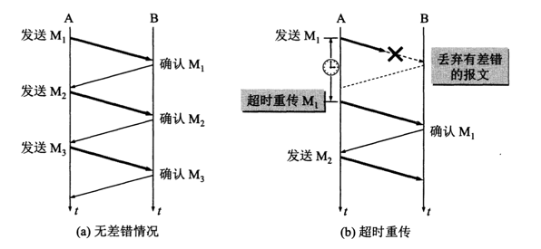
> 2、出现差错
> ``` 上图b是分组在传输过程中出现差错的情况 B接收M1时检查出了差错 就丢弃了M1 其他什么也不做 也可能是M1在传输过程中丢失了 这时B也什么都不知道。 在这两种情况下 B都不会发送任何信息 可靠传输协议时这样设计的：A只要超过一段时间仍然没有收到确认 就认为刚才发送的分组丢失了 因而重传前面发送过的分组 这叫做超时重传 需要设置超时计时器 如果在超时计时器到期前收到了对方的确认 就撤销这个分组的超时计时器```
> ``` A在发送完一个分组后 必须暂时保留已发送的分组副本 只有收到确认后才能清除；  分组和确认分组都必须进行编号 这样才能明确哪一个发出去的分组收到了确认 哪一个没有；  超时计时器设置的重传时间应当比数据在分组传输的平均往返时间更长一些```
> 3、确认丢失和确认迟到
> 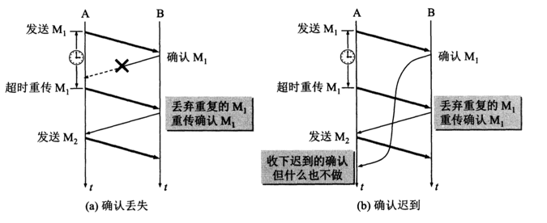
> ```图a表示确实丢失 A没有收到确认且超过了超时时间 也无法知道是自己发出的分组出错、丢失还是确认丢失了， A重传M1， B又收到了M1 应该采取两个行动 ： 1、丢弃这个分组M1 2、向A发送确认```
> ``` 图b表示确认迟到  A会收到重复的确认 A处理方式很简单，收下后就丢弃 B仍会收到重复的M1 丢弃并重传确认```
> 
> 使用上述确认和重传机制 就可以在不可靠的传输网络上实现可靠的通信 这种协议通常称为 自动重传请求ARQ（Automatic Repeat Request）  重传的请求是自动进行的
> 停止等待协议效率低
> 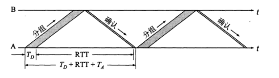
> 为了提高传输效率 采用流水线传输  发送方可以连续发送多个分组 不必每发完一个分组就停下来等待确认（连续ARQ协议 和 滑动窗口协议）
> 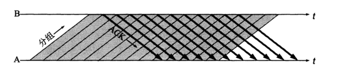

> 连续ARQ协议
> 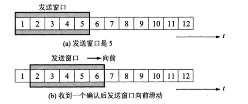
> 发送方每收到一个确认 就把发送窗口向前滑动一个分组的位置  接收方一般采用累计确认的方式  接收方不必对收到的分组逐个发送确认 而是在收到几个分组后 对按序到达的最后一个分组发送确认 代表到这个分组为止的所有分组已正确收到 
> 
##### TCP报文段首部格式
> 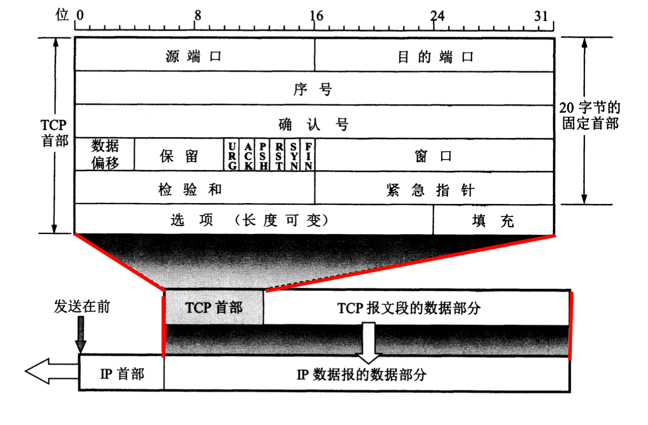
> 前20字节固定  因此TCP首部最小长度是20字节 4n的选项长度不能超过40字节 也就是TCP首部最大长度是60字节
> 控制位 ：1、确认ACK 仅当ACK = 1时确认号字段才有效  TCP规定，在连接建立后所有传送报文段都必须把ACK置1。  2、同步SYN 在建立连接时用来同步序号 当SYN = 1而ACK = 0时 表明这是一个连接请求报文段 若对方同意连接 响应报文段中SYN = 1 和 ACK = 1  3、窗口  允许对方发送的数据量
> 

##### TCP可靠传输实现
> 1、以字节为单位的滑动窗口
> TCP滑动窗口是以字节为单位的 假定A收到B发来的确认报文段，其中窗口是20字节 确认号是31（表明B期望收到下一个序号是31 30为止的数据已经收到了） A构造自己的发送窗口
> 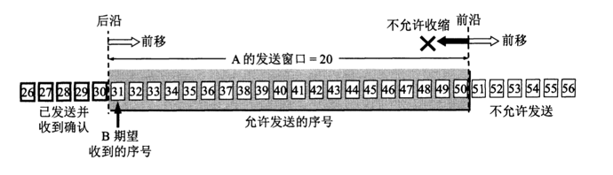
> 发送窗口表示 在没有收到B的确认的情况下 A可以连续把窗口内的数据都发出去 凡是已经发过的数据，在未确认前都必须暂时保留 以便超时重传时使用（A的发送窗口不能超过B的接收窗口数值  此外还受到网络拥塞的制约）
> 
> 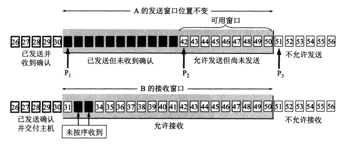
> 描述一个发送窗口的状态需要三个指针 p1，p2，p3
> 小于p1的是已发送并已收到确认的部分  大于p3是不允许发送的部分
> p3 - p1 = A的发送窗口
> p2 - p1 = 已发送但尚未收到确认的字节数
> p3 - p2 = 允许发送但尚未发送的字节数（可用窗口）
> 上图中 B接收到了序号为32 和 33的数据 但是31号没有接收到 即未按序到达 B发送确认报文段中的确认号仍然是31
> 
> 
> 发送方的应用程序把字节流写入TCP的发送缓存  接收方的应用程序从TCP的接收缓存中读取字节流
> 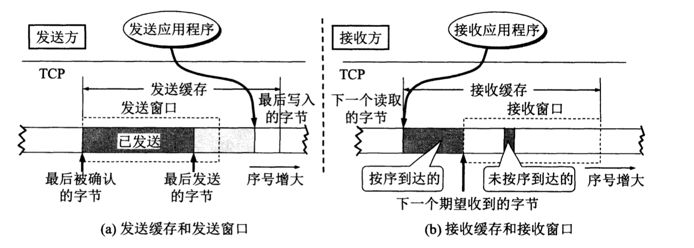
> （1）缓存空间和序号空间都是有限的 并且都是循环使用的
> （2）实际上缓存或窗口的字节数非常大
> 发送缓存用来存放 ： 1、发送应用程序传给发送方TCP准备发送的数据 2、TCP已发出但尚未收到确认的数据 
> 由此可见 发送窗口通常只是发送缓存的一部分
> 
> 接收缓存用来存放 ： 1、按序到达的、但尚未被接收应用程序读取的数据 2、未按序到达的数据
> 
* 虽然A的发送窗口根据B的接收窗口设置 但在同一时刻 A的发送窗口并不总和B的接收窗口一样大
* 对于不按序到达的数据如何处理 TCP并无明确规定  通常对不按序到达的数据先临时存放在接收窗口 等待字节流中所缺失的字节收到后  再按序交付上层的应用程序
* TCP要求接收方必须有累积确认的功能 减少传输开销。 接收方可以在合适的时候发送确认 也可以在自己有数据要发送时把确认信息捎带上（不常见）  TCP规定确认推迟时间不应该超过0.5秒 若收到一连串具有最大长度的报文段 则每隔一个报文段就发送一个确认

> 2、超时重传时间选择
> TCP采用一种自适应算法 记录一个报文段发出时间以及收到确认的时间  这两个时间之差就是   报文段的往返时间 RTT
> TCP保留RTT的一个加权平均往返时间RTTs(平滑往返时间)
> 新的RTTs = (1 - ß) * 旧的RTTs + ß * 新的RTT样本 推荐ß = 1/8
> 超时重传时间RTO   RTO = RTTs + 4 * RTTd  （RTTd为RTT的偏差的加权平均值）
> 
> 在计算加权平均RTTs时 只要报文段重传了 就不采用其往返时间样本  （由于无法判定确认报文段是重传前的还是重传后的）
> 但是上述算法有可能导致超时重传时间无法更新 
> 修正 ： 报文段每重传一次 就把超时重传时间RTO增大一些  典型做法是取新的重传时间为旧的重传时间的2倍 当不在发生重传时 通过RTO公式计算
> 
> 3、选择确认SACK
> 若收到的报文段无差错 只是未按序号 设法只传送缺少的数据而不重传已经正确到达接收方的数据

#### TCP流量控制
> 1、利用滑动窗口实现流量控制
> 流量控制就是指 让发送方发送速率不要太快 要让接收方来得及接收
> 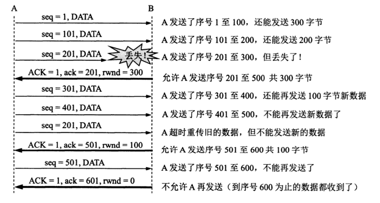
> 设A像B发送数据 B告诉A"我的接收窗口rwnd=400" 发送方发送窗口不能超过接收方给出的接收窗口值
> 设每一个报文段为100字节长 报文段序号初始值设为1  大写ACK表示确认为 小写ack表示确认值
> 接收方B进行了三次流量控制  第一次减小到300 第二次减小到100 最后一次0 即不允许发送数据 这种发送方暂停发送的状态一直持续到B重新发送一个新的窗口为止
> 
> 如果 B向A发送0窗口不久后 发送了rwnd=400的报文段 然而这个报文段丢失  A一直等待B发送非0窗口通知 B一直在等待A发数据 进入相互等待死锁
> 为了解决上述问题  TCP为每一个连接设置一个持续计时器  只要TCP有一方收到对方的零窗口通知 就启动持续计时器  若持续计时器时间到 就发送一个零窗口探测报文段（仅携带1个字节的数据） 对方在确认这个探测报文段时给出现在的窗口值 如果仍是0 重新设置一个持续计时器 如果不是0 死锁局面打破
> 
> 2、TCP传输效率
> 不同机制控制TCP发送报文的时机 ：1、TCP维持一个变量 它等于最大报文长度MSS 只要缓存中存放的数据到达MSS字节就发送   2、由应用程序指明发送报文段 即推送 3、发送方计时器时间到
> 
> 问题1：用户只发了1个字符  就传输  由于报文的各种首部  发送效率会很低
> Nagle算法 ： 若发送方应用进程要把发送的数据逐个字节的送到TCP发送缓存 则发送方就把第一个数据字节先发送出去 把后边到达的数据字节都缓存起来  当发送方接收到对第一个数据字符的确认后， 再把发送缓存中所有数据组成一个报文段发送出去 同时继续对随后到达的数据进行缓存  当数据已到达发送窗口大小的一半 或者达到报文段的最大长度时 就立即发送一个报文段
> 问题2： 糊涂窗口综合征 TCP接收方缓存已满 而交互式应用进程每次只从缓存中读一个字节的数据 然后向发送方确认 窗口设置成1  接着发送方又发来1个字节数据 接收方确认 窗口仍是1  网络效率很低
> 让接收方等待一段时间 使得 或者接收缓存已有一个空间容纳一个最长的报文段 或者等待接收缓存已有一般的空闲空间
> 
#### TCP的拥塞控制
>  拥塞 ：如果网络中对某一资源的需求超过了该资源所能提供的可用部分 网络性能就要变坏 ∑对资源的需求 > 可用资源
> 拥塞控制 ： 防止过多的数据注入到网络中 这样可以使网络中的路由器或链路不至于过载 是一个全局性的过程  （流量控制往往是点对点的通信量控制 是个端到端的问题 ）
> 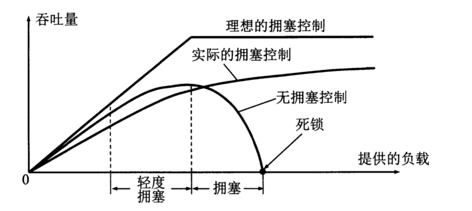
> 开环控制 ： 设计网络时事先将有关发生拥塞的因素考虑周到，力求在网络在工作时不产生拥塞
> 闭环控制 ： 1、监测网络系统以便检测到拥塞在何时、何处发生   2、把拥塞发生的信息传送到可以采取行动的地方  3、调整网络系统的运行
> 
> 1、TCP的拥塞控制方法
> 四种 ： 慢开始（slow-start）  拥塞避免（congestion avoidance）  快重传（fast retransmit）   快恢复（fast recovery）
> （1）慢开始和拥塞避免
* 也叫基于窗口的拥塞控制  发送方维持一个叫做 拥塞窗口cwnd 的状态变量  拥塞窗口的大小取决于网络的拥塞程度，并且在动态发生变化  发送方让自己的发送窗口等于拥塞窗口
> 发送方控制拥塞窗口的方法 ： 只要网络没有出现拥塞 拥塞窗口就可以再增大一些 但只要网络出现拥塞或有可能出现拥塞 就必须把拥塞窗口减少一些
> 由于现在通信线路一般都很好 传输出差错而丢失分组的概率极小  因此  判断网络拥塞的依据就是出现了超时
> 
* 慢开始  当主机开始发送数据时 由于不清楚网络的负荷情况 如果立即把大量数据字节注入到网络有可能拥塞  较好的方法是  先探测一下 即  由小到大逐渐增大发送窗口  也就是由小到大逐渐增大拥塞窗口数值
* SMSS（发送方最大报文段） 若SMSS > 2190字节  初始拥塞窗口 cwnd = 2 * SMSS 且不得超过两个报文段   若 1095 ≤ SMSS < 2190 初始拥塞窗口cwnd = 3 * SMSS 且不得超过3个报文段 若SMSS ≤ 1095 初始拥塞窗口cwnd = 4 * SMSS 且不得超过4个报文段
* 在每收到一个新的报文段确认后 可以把拥塞窗口增加最多一个SMSS数值  拥塞窗口cwnd每次增加的数量 = min(N, SMSS)  N是原来未被确认、但现在被刚收到的确认报文字段所确认的字节数
* 逐步增大拥塞窗口
> 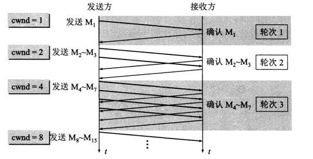
> 每经过一个传输轮次（把cwnd所允许的报文全发出去并且收到了已发送的最后一个字节的确认）  拥塞窗口cwnd就加倍
> 在实际TCP运行中 发送方只要接收到一个对新报文段的确认 拥塞窗口立即 + 1 并可以立即发送新的报文  而不需要等待收到这个轮次中所有的确认
> 
> 为了防止拥塞窗口cwnd增长过大而引起网络拥塞  还需要设置一个 慢开始门限（ssthresh） 当cwnd < ssthresh 使用慢开始算法  当cwnd > ssthresh 停止使用慢开始算法而改用拥塞避免算法  当cwnd = ssthresh 既可以使用慢开始算法 又可以使用拥塞避免算法
> 
> 拥塞避免  让拥塞窗口cwnd缓慢增大 每经过一个RTT就把拥塞窗口+1 而不像慢开始一样成倍增大  按线性规律缓慢增长
> 