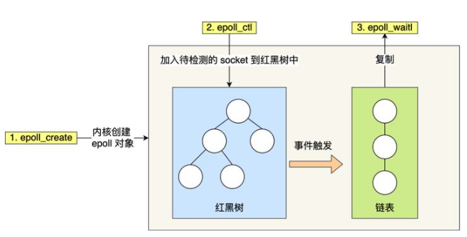

# IO多路复用

*select / poll / epoll 三个多路复用接口*

## select

> 实现方式 : 将已连接的socket都放到一个**文件描述符集合**  调用*select函数*将文件描述符集合拷贝到内核里, 让内核来检查是否有网络事件产生, 检查方式就是通过**遍历**文件描述符集合. 当检查到有事件产生后, 将此socket标记为可读或可写, 接着再把整个文件描述符拷贝回用户态里, 然后用户态还需要再通过**遍历**的方法找到可读或可写的Socket  然后再对其处理

> 对于select这种方式   需要进行**2次 遍历 文件描述符集合**  一次在内核态  一次在用户态, 还会发生**2次  拷贝  文件描述符集合** 先从用户空间传入内核, 由内核修改后, 再传出到用户空间中

> select使用固定长度的BitsMap  表示文件描述符集合  而且所支持的文件描述符的个数是有限制的  在Linux中 由内核中的FD_SETSIZE限制   默认最大值是1024

## poll

> poll和select并没有太大本质区别   都是使用**线性结构**存储进程关注的socket集合

> poll不适用BitsMap来存储所关注的文件描述符   取而代之用 **动态数组**  以**链表**形式来组织  突破select文件描述符个数限制, 但还会受到系统文件描述符限制

## epoll

> epoll在内核里使用**红黑树**来跟踪进程所有待检测的文件描述字, 把需要监控的socket通过*epoll_ctl()*函数加入到红黑树里,  通过对这颗红黑树进行操作, 不需要像select/poll每次操作时都传入整个socket集合  只需要传入一个待检测的socket  减少了内核和用户空间大量的数据拷贝和内存分配

> epoll使用事件驱动的机制, 内核里**维护一个链表记录就绪事件**, 当某个socket有事件发生, 通过回调函数  内核会将其加入到这个就绪事件列表中, 当用户调用*epoll_wait()*函数, 只会返回有事件发生的文件描述符的个数  不需要像select/poll那样轮询扫描整个socket集合,大大提高了检测效率

### epoll两种事件触发模式

*边缘触发(ET) / 水平触发(LT)*

> 边缘触发 : 当被监控的Socket描述符上有可读事件发生时, **服务器端只会从epoll_wait中苏醒一次**. 即使进程没有调用read函数也从内核中读取数据, 也依然只苏醒一次, 因此程序要保证一次性将*内核缓冲区*的数据读取完

> 水平触发 : 当被监控的socket上有可读事件发生时 **服务器端不断从epoll_wait中苏醒 直到内核缓冲区数据被read函数读完才结束**, 目的是告诉我们有数据需要读取.