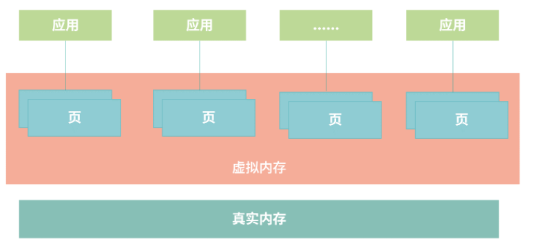
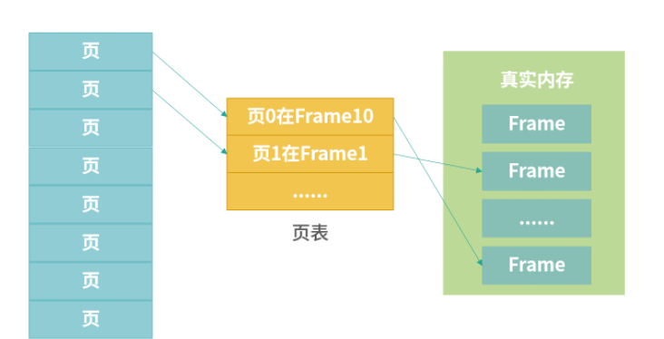

# 操作系统

## 进程、重定向和管道指令：xargs

### 进程

*应用的可执行文件是放在操作系统里面的 把可执行文件启动  就会在操作系统里（内存中）形成一个应用副本 这个副本就是进程*

### 管道

*管道（pipline）的作用是在命令和命令之间 传递数据   更准确的说  管道在进程间传递数据*

#### 输入输出流

*每个进程拥有自己的标准输入流 标准输出流  标准错误流*

> 标准输入流(用0表示) 可以作为进程执行的上下文(进程执行可以从输入流中获取数据)
>
> 标准输出流(用1表示) 写入的结果会被打印到屏幕上
>
> 如果进程在执行过程中发生异常  那么异常信息就会被记录到标准错误流中(用2表示)

#### 重定向

> '>'符号叫做 覆盖重定向;  '>>' 叫做 追加重定向

#### 管道的作用和分类

*管道  将一个进程的输出流定向流到另一个进程的输入流  作用就是把这两个文件连接起来. 如果一个进程输出了一个字符X  那么另一个进程就会获得X这个输入*

> 两种类型的管道:
>
> 1.匿名管道(Unnamed Pipeline) : 这种管道在文件系统中  但是只是一个存储节点  不属于任何一个目录  (没有路径)
>
> 2.命名管道(Named Pipeline) : 这种管道就是一个文件  有自己的路径

> FIFO : 管道具有FIFO属性

#### xargs

*xargs指令从标准数据流中构造并执行一行行的指令*

## Linux内核和Windows内核有什么区别

*内核 : 操作系统中应用连接硬件设备的桥梁*

### 内核的能力

> 管理进程.线程(决定哪个进程  线程 使用CPU)
>
> 管理内存(决定内存用来做什么)
>
> 连接硬件设备(为进程和设备间提供通信能力)
>
> 提供系统调用(接收进程发来的系统调用)

### 内核是如何工作的

> 内核的权限非常高, 它可以管理进程,可以直接访问所有的内存 
>
> 一般操作系统设计遵循的原则 : 进程向内核发起一个请求  然后将CPU执行权限让出给内核. 内核接手CPU执行权限 完成请求 再让出CPU执行权限给调用进程

### Linux的设计

> Multitask and SMP : 
>
> Multitask 指 多任务
>
> SMP 指 对称多处理

> ELF : 
>
> 可执行文件链接格式

> Monolithic Kernel : 宏内核

### Windows设计

*目前内核都是Windows NT*

> Windows同样支持Multitask 和 SMP   
>
> Windows内核设计属于混合类型  有一个Microkernel模块  整个内核实现又像宏内核一样
>
> 也有自己的可执行文件格式  叫做PE

## 用户态线程 和 内核态线程 有什么区别

### 什么是用户态和内核态

*Kernel运行在超级权限模式下  所以拥有很高的权限   按照权限管理的规则  多数应用程序 应该运行在最小的权限下  因此 很多操作系统将内存分成了两个区域 : 内核空间    用户空间*

> 内核空间 : 这个空间只有内核程序可以访问
>
> 用户空间 : 这部分内存专门给应用程序使用

#### 用户态和内核态

*用户空间中的代码被限制了只能使用一个局部的内存空间  我们说这些程序在 **用户态** 执行    内核空间中的代码可以访问所有内存  我们称这些程序在 **内核态**执行*

#### 系统调用过程

> 内核程序执行在内核态  用户程序执行在用户态
>
> 当发生系统调用时  用户态的程序发起系统调用  因为系统调用中牵扯特权指令  用户态程序权限不足  因此会中断执行 也就是Trap
>
> 发生中断后  当前CPU执行的程序会中断  跳转到中断处理程序. 内核程序开始执行  也就是开始处理系统调用  内核处理完成后 主动触发Trap  这样会再次发生中断  切回用户态工作

### 线程模型

#### 进程和线程

> 进程可以分成用户态进程 和 内核态进程   用户态进程通常是应用程序的副本.  内核态进程就是内核本身的进程.  如果用户态进程需要申请资源  比如内存  可以用过系统调用向内核申请

> 程序 在现代操作系统中并不是以进程为单位在执行  而是以一种轻量级进程  也称作 线程 的形式执行. 一个进程可以拥有多个线程  进程创建的时候 一般会有一个主线程随着进程创建而创建
>
> 进程可以通过API创建用户态的线程    也可以通过系统调用创建 内核态 的线程

##### 用户态线程

*用户态线程 也称作  用户级线程    操作系统内核并不知道它的存在 它完全在用户空间中创建*

> 优势
>
> 管理开销小 : 创建和销毁不需要系统调用
>
> 切换成本低 : 用户空间程序可以自己维护 不需要走系统调用

> 缺点
>
> 与内核协作成本高 : 这种线程完全是用户空间程序在管理  当它进行I/O的时候  无法利用内核的优势 需要频繁进行用户态到内核态的切换
>
> 线程间协作成本高 : 想要两个线程通信  就需要 I/O  I/O需要系统调用  因此用户态线程需要支付额外的系统调用成本
>
> 无法利用多核优势 :  操作系统调度的仍然是这个线程所属的进程  所以无论每次一个进程有多少个用户态的线程  都只能并发执行一个线程 因此一个进程的多个线程无法利用多核的优势
>
> 操作系统无法针对线程调度进行优化

##### 内核态线程

*内核态线程  也称作  内核级线程   这种线程执行在内核态  可以通过系统调用创造一个内核级线程*

> 优势
>
> 可以利用CPU多核优势 : 内核拥有较高的权限  因此可以在多个CPU核心上执行内核线程
>
> 操作系统级优化 : 内核线程操作I/O不需要进行系统调用; 一个内核线程阻塞了, 可以立即让另一个执行

> 缺点
>
> 创建成本高 
>
> 扩展性差
>
> 切换成本高

#### 用户态线程和内核态线程之间的映射关系

*线程简单理解   就是要执行一段程序. 程序不会自发执行  需要操作系统进行调度*

> 如果有一个用户态的进程 它下面有多个线程  如果这个进程想要执行下面某一个线程  比较常见的一种方式是  将需要执行的程序 让一个内核线程去执行  毕竟  内核线程是真正的线程  因为它会分配到CPU的执行资源
>
> 如果一个进程所有的线程都要自己调度  相当于进程的主线程中实现分时算法调度每一个线程   也就是所有线程都用操作系统分配给主线程的时间片段执行. 这种做法 相当于操作系统调度进程的主线程; 进程的主线程进行二级调度  调度自己内部的线程
>
> 这样操作劣势非常明显  : 无法利用多核优势    每个线程调度分配到的时间较少.  这种线程在阻塞场景下会直接交出整个进程的执行权限

*通常在内核中预先创建一些线程  并反复利用这些线程 这样 用户态线程和内核态线程就构成下面4中可能的关系*

> 多对一
>
> 用户态进程中的多线程复用一个内核线程  但是线程不可以并发

> 一对一
>
> 为每个用户态线程分配一个单独的内核态线程  这种模型允许所有线程并发执行 能充分利用多核优势  WindowsNT内核采取这种模型  但是线程较多  对内核调度的压力会明显增加

> 多对多
>
> N个用户态线程分配M个内核态线程   m通常可以小于n. 一种可行的策略是将m设置为核数  Linux目前采用该模型

> 两层设计
>
> 混合多对多和一对一  多数用户态线程和内核线程是n对m的关系  少量用户线程可以指定成1对1的关系

## 进程间通信都有哪些方法

*进程间通信 就是 交换数据.  *

> 管道

> 本地内存共享

> 本地消息/队列

> 远程调用RPC

> 消息队列

## 虚拟内存

*虚拟化技术是为了解决内存不够用的问题*

### swap技术

> 允许一部分进程使用内存 , 不使用内存的进程数据先保存在磁盘上. 轮到某个进程执行的时候  尝试为这个进程在内存中找到一块空闲区域  如果空间不足  就考虑把没有在执行的进程交换到磁盘上  把空间腾挪出来给需要的进程

> 缺点
>
> 碎片问题 
>
> 频繁切换问题

### 虚拟内存

*虚拟化技术中  操作系统设计了虚拟内存(理论上可以无限大的空间)  受限于CPU的处理能力  通常64bitCPU  就是264个地址*

> 虚拟化技术中心  应用使用的是虚拟内存   操作系统管理虚拟内存和真实内存之间的映射. 
>
> 操作系统将虚拟内存分成整齐小块  每个小块称为一个 **页**
>
> 一方面应用使用内存是以页为单位  整齐的页能够避免内存碎片的问题
>
> 另一方面 每个应用都有高频使用的数据和低频使用的数据   这样做  操作系统就不必从应用角度思考哪个进程是高频的  仅需思考哪些页被高频使用  哪些页被低频使用  如果是低频使用  就将它们保存在硬盘上; 如果高频  就让它们保留在真实内存中

#### 页和页表

*操作系统将虚拟内存分块  每个小块称为一个 页  ;  真实内存也需要分块   每个小块称为  Frame   Page到Frame的映射  需要一种叫做  页表 的 结构*

> 页表维护了虚拟地址到真实地址的映射   每次程序使用内存时  需要把虚拟内存地址换算成物理内存地址:
>
> 1.通过虚拟地址计算Page编号
>
> 2.查页表  根据Page编号  找到Frame编号
>
> 3.将虚拟地址换算成物理地址

#### MMU

*MMU  内存管理单元*

> 当CPU需要执行一条指令时, 如果指令涉及内存读写操作, CPU会把虚拟地址给MMU; MMU自动完成虚拟地址到真实地址的计算  然后 MMU连接了地址总线  帮助CPU操作真实地址