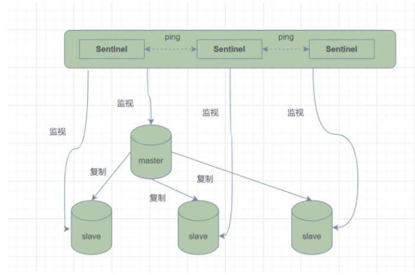
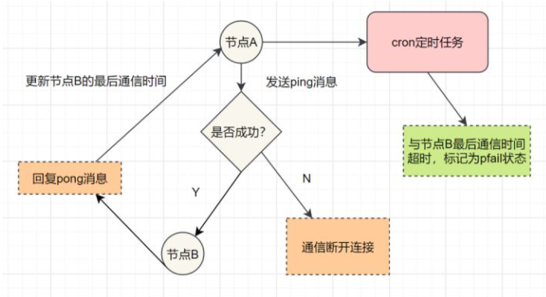
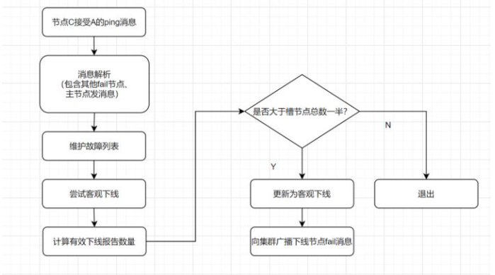
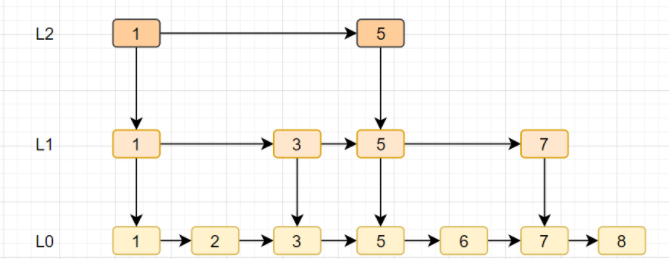

# Redis 20问

## Redis的基本数据结构类型

> String
>
> Hash
>
> List
>
> Set
>
> zset
>
> 还有三种特殊数据结构类型: Geospatial    Hyperloglog    BitMap

## Redis 基本数据结构

> String(字符串):
>
> 二进制安全  可以存储图片或者序列化的对象  值最大存储为512M
>
> 应用场景 : session  分布式锁   计数器   限流
>
> 内部编码 : int(8字节长整型)/ embstr(小于等于39字节字符串) / raw(大于39个字节字符串)
>
> 使用SDS(simple dynamic string)封装

> Hash(哈希):
>
> 内部编码 : ziplist(压缩列表)  hashtable(哈希表)
>
> 应用场景 : 缓存用户信息
>
> 注意点 : hgetall如果哈希元素比较多的话  可能导致Redis阻塞  可以使用hscan  如果只是获取部分field 建议使用hmget

> List(列表):
>
> 内部编码 : ziplist   linkedlist
>
> 应用场景 : 消息队列  文章列表

> set(集合):
>
> 用来保存多个字符串元素  但是不允许有重复元素
>
> 内部编码 : intset(整数集合)   hashtable(哈希表)
>
> 注意点 : smembers 和 lrange hgetall 都属于比较重的命令 如果元素过多存在阻塞redis的可能性  可以使用sscan来完成
>
> 应用场景 : 用户标签  生成随机数抽奖  社交需求

> zset(有序集合):
>
> 已排序的字符串集合  同时元素不能重复 
>
> 内部编码 : ziplist  skiplist(跳跃表)
>
> 应用场景 : 排行榜  社交需求(如用户点赞)

## Redis三种特殊数据类型

> Geo : 地理位置定位 用于存储地理位置信息 并对存储的信息进行操作
>
> HyperLogLog : 用来做基数统计算法的数据结构
>
> Bitmaps :用一个比特位来映射某个元素的状态 底层基于字符串类型实现 

## Redis为什么快

> 1.基于内存存储实现 : 内存读写比在磁盘快很多 Redis基于内存存储实现 省去磁盘I/O的消耗
>
> 2.高效的数据结构
>
> 3.合理的数据编码:
>
> ​	String如果存储数字 用int类型编码 如果存储非数字  小于39字节地字符串是embstr 大于39字节则是raw编码
>
> ​	List  如果列表元素个数小于512个  列表每个元素值都小于64字节 使用ziplist 否则使用linkedlist
>
> ​	hash  哈希类型元素个数小于512个 所有值小于64字节 使用ziplist 否则使用 hashtable
>
> ​	set 如果集合中元素都是整数且元素个数小于512个 使用intset编码 否则使用hashtable
>
> ​	zset  当有序集合元素个数小于128个 每个元素值小于64字节 使用ziplist 否则使用skiplist
>
> 4.合理的线程模型 (I/O多路复用)
>
> 5.单线程模型  避免CPU不必要的上下文切换和竞争锁的消耗

## 虚拟内存机制

> Redis自己构建了VM机制  
>
> 暂时把不经常访问的数据(冷数据)从内存交换到磁盘中, 从而腾出内存空间用于其他需要访问的数据(热数据).通过VM功能可以实现冷热数据分离,使热数据仍在内存中 冷数据保存在磁盘中  避免因为内存不足而造成访问速度下降的问题

## 什么是热Key问题 如何解决热Key问题

> 在Redis中 把访问频率高的Key 称为热Key
>
> 如果某个热点key的请求到服务器主机时,由于请求量特别大 可能导致主机资源不足,甚至宕机 , 从而影响正常的服务.
>
> 产生原因 : 1.用户消费的数据远大于生产的数据  如秒杀 热点新闻等读多写少的场景    2.请求分片集中,超过单Redis服务器的性能  比如固定名称的Key  hash之后落入同一台服务器  瞬间访问量极大 超过机器瓶颈 产生热key问题
>
> 如何解决热Key问题: 1.Redis集群扩容 增加分片副本 均衡读流量   2.将热Key分散到不同的服务器中  3.使用二级缓存 即JVM本地缓存 减少Redis的读请求

## Redis过期策略和内存淘汰策略

> 过期策略:
>
> 1.定时过期 : 每个设置过期时间的key都需要创建一个定时器 到过期时间就会立即对key进行清除. 该策略可以立即清除过期数据 对内存友好 , 但是会占用大量的CPU资源去处理过期的数据  从而影响缓存的响应时间和吞吐量
>
> 2.惰性过期: 只有当访问一个key时  才会判断该key是否已经过期  过期则清除. 该策略可以最大化节省CPU资源 但是对内存不友好  极端情况下可能出现大量的过期key没有再次被访问 从而不会被清除 占用大量内存
>
> 3.定期过期 : 每隔一定的时间 会扫描一定数量的数据库的expires字典中一定数量的key 并清除已经过期的key 是前两者的这种方案
>
> Redis同时使用了惰性过期和定期过期两种过期策略

> 内存淘汰策略:
>
> 1.volatile-lru : 当内存不足以容纳新写入数据时 从设置了过期时间的key中使用LRU算法进行淘汰
>
> 2.allkeys-lru : 当内存不足以容纳新写入数据时 从所有key中使用LRU算法进行淘汰
>
> 3.volatile-random : 当内存不足以容纳新写入数据时 从设置了过期时间的key中 随机淘汰数据
>
> 4.allkeys-random : 当内存不足以容纳新写入的数据时  从所有key中随机淘汰数据
>
> 5.volatile-ttl : 当内存不足以容纳新写入数据时  在设置了过期时间的key中 根据过期时间进行淘汰 越早过期的优先被淘汰
>
> 6.noeviction : 默认策略  当内存不足以容纳新写入数据时  新写入操作会报错
>
> -- 新增:
>
> volatile-lfu : 在设置了过期的key中 使用LFU算法
>
> allkeys-lfu : 从所有key中使用LFU算法

## Redis高可用

### 主从

### 哨兵模式

> 哨兵模式 : 主从模式中 一旦主节点出现故障不能提供服务 需要人工将从节点升为主节点 同时还要通知应用方更新主节点地址 使用Redis Sentinel架构解决这个问题
>
> *哨兵模式  由一个或者多个sentinel实例组成的sentinel系统 它可以监视所有的Redis主节点和从节点 并在被监视的主节点进入下线状态时  自动将下线主服务器属下的某个从节点升级为新的主节点 但是 一个哨兵进程对Redis节点进行监控 可能会出现单点问题 因此 可以使用多个哨兵来进行监控Redis节点  并且各个哨兵之间还会进行监控*
>
> 

> 哨兵模式作用:
>
> 1.发送命令 等待Redis服务器(包括主和从) 返回监控其运行状态
>
> 2.哨兵检测到主节点宕机 会自动将从节点切换成主节点  然后通过发布订阅模式通知其他的从节点 修改配置文件 让它们切换主机
>
> 3.哨兵之间还会互相监控  达到高可用

> 故障切换过程:
>
> 假设主服务器宕机  哨兵1线检测到这个结果 并不会马上进行failover过程  仅仅是哨兵1主观认为主服务器不可用  这个现象称为**主观下线**  当后边的哨兵也检测到主服务器不可用 并且达到一定值时 哨兵之间就会进行一次投票  投票的结果由一个哨兵发起 进行failover操作  切换成功后,就会通过发布订阅模式 让各个哨兵把自己监控的从服务器实现切换主机  这个过程称为客观线下  对客户端是透明的

> 哨兵的工作模式
>
> 1.每个sentinel以每秒钟一次的频率向它所知的master slave以及sentinel实例发送一个ping命令
>
> 2.如果一个实例距离最后一次有效回复ping命令时间超过 down-after-milliseconds选项所指定的值 则这个实例会被Sentinel标记为主管下线
>
> 3.如果一个master被标记为主观下线  则正在监视这个master的所有sentinel要以美妙一次的频率确认master确实进入了主管下线状态
>
> 4.当有足够数量的Sentinel在指定的时间范围内确认master进入主管下线状态  则master会被标记为客观下线
>
> 5.在一般情况下  每个sentinel会以每10秒一次的频率向它已知的所有master slave发送INFO命令
>
> 6.当master被sentinel标记为客观下线时, sentinel向下线的master的所有slave发送info命令的频率会从10秒一次改为1秒1次
>
> 7.若没有足够的sentinel同意master已经下线  master客观下线状态会被移除;若master重新向sentinel的ping命令返回了有效回复  master主观下线状态会被移除

### Cluster 集群模式

> 哨兵模式基于主从模式  实现读写分离 还可以自动切换 但是它每个节点存储的数据是一样的 浪费内存 并且不好扩容 因此引入了集群模式  实现Redis的**分布式存储**  对数据进行分片  也就是说 **每台Redis节点上存储不同的内容** 来解决在线扩容的问题  并且提供复制和故障转移的功能

> Cluster集群节点的通讯
>
> 一个Redis集群由多个节点组成  各个节点之间通信是通过 **Gossip协议**
>
> Redis Cluster集群通过Gossip协议进行通信  节点之间不断交换信息  交换的信息内容包括**节点出现故障, 新节点加入, 主从节点变更信息, slot信息等**  常用的Gossip消息分为4种 分别为 **ping , pong, meet, fail**

> meet消息 : 通知新节点加入. 消息发送者会通知接收者加入到当前集群  meet消息通信正常完成后  接收节点会加入到集群中并进行周期性的ping pong消息交换
>
> ping消息 : 集群内交换最频繁的消息  集群内每个节点每秒向多个其他节点发送ping消息  用于检测节点是否在线和交换彼此状态信息
>
> pong消息 : 当接收到ping  meet消息时  作为响应消息恢复给发送方确认消息正常通信  pong消息内部封装了自身状态数据 . 节点也可以向集群内广播自身的pong消息来通知整个集群对自身状态进行更新
>
> fail消息 : 当节点判定集群内另一个节点下线时  会向集群内广播一个fail消息  其他节点接收到fail消息之后把对应节点更新为下线状态
>
> *每个节点是通过**集群总线**与其他节点进行通信  通信时  用特殊的端口号 即对外服务端口号 加 10000  nodes之间的通信采用特殊的二进制协议*

> Hash Slot插槽算法
>
> Cluster集群使用的分布式算法是 **Hash Slot插槽算法**
>
> 把整个数据库分为16384个slot(槽) 每个进入Redis的键值对 根据key进行散列  分配到插槽中的一个. 使用哈希映射也比较简单 用CRC16算法计算出一个16位的值  再对16384取模   每个键都属于这些槽中的一个  集群的每个节点都可以处理这些槽
>
> 集群中每个节点负责一部分hash槽 比如当前有A B C个节点 每个节点上的哈希槽数 = 16384 / 3 则:
>
> A负责 0 - 5460号哈希槽
>
> B负责5461 - 10922号哈希槽
>
> C负责10923 - 16383号哈希槽

> Redis Cluster集群中 要确保所有槽对应的node都可以正常工作  如果某个node出现故障 它负责的slot也会失效 整个集群不能工作  因此  为了保证高可用  Cluster集群引入了主从复制  一个主节点对应一个或者多个从节点.  *当其它主节点ping一个主节点A时  如果半数以上的主节点与A通信超时  那么认为A宕机了  如果主节点宕机时  就会启用从节点*

> 在Redis每个节点上  都有两个东西  一个是 **插槽(slot)**  另外一个是 **cluster**  可以理解为一个集群管理的插件   当我们存取的key到达时, redis根据CRC16算法算出一个16bit的值 然后把结果对16384取模 这样每个key都在0-16384之间的哈希槽  通过这个值  去找到对应的插槽所对应的节点  然后直接自动跳转到这个对应节点上进行存取操作

> 故障转移 : 
>
> Redis集群实现了高可用  当集群内节点出现故障时  通过故障转移  以保证集群正常对外提供服务
>
> Redis通过ping/pong消息  实现故障转移  包括 **主观下线**和**客观下线**
>
> **主观下线** : 某个节点认为另一个节点不可用  即下线状态  这个状态并不是最终的故障判定  只能代表一个节点的意见  可能存在误判的情况
>
> 
>
> **客观下线** : 标记一个节点真正下线  集群内多个节点都认为该节点不可用 从而达成共识的结果  如果是持有槽的主节点故障 需要为该节点进行故障转移
>
> * 加入节点A标记B为主管下线  一段时间后  节点A通过消息把节点B状态发到其他节点  当C接受到消息并解析出消息体时  如果发现B为pfail状态 会触发客观下线流程
>
> * 当下线为主节点时  此时Redis Cluster集群为统计持有槽的主节点投票  看投票数是否达到一半  当下线报告统计数大于一半时  标记为客观下线
>
>   

> 故障恢复 : 
>
> 故障发现后  如果下线节点是主节点 则需要在它的从节点选一个替换它  以保证集群的高可用:
>
> 1.资格检查 : 检查从节点是否具备替换故障主节点的条件
>
> 2.准备选举时间 : 资格检查通过后  更新触发故障选举时间
>
> 3.发起选举 : 到了故障选举时间 进行选举
>
> 4.选举投票 : 只有持有槽的**主节点**才有票  从节点收集到足够的选票(大于一半) 触发替换主节点操作

## Redis分布式锁 有哪些注意点

> 1.setnx + expire 分开写 : 如果setnx执行完  正要执行expire设置过期时间 进程crash掉或者要重启维护了 那么这个锁就 长生不老了 别的线程永远获取不到锁
>
> 2.setnx + value 值是过期时间:  过期时间是客户端自己生成的 在分布式环境下 每个客户端时间必须同步; 没有保存持有者的唯一标识  可能被别的客户端释放锁; 锁过期的时候 并发多个客户端同时请求过来 都执行了getSet操作 最终只有一个客户端加锁成功 但是该客户端锁的过期时间 可能被别的客户端覆盖
>
> 3.set扩展命令 (set ex px nx) : 锁过期释放了,业务还没执行完; 锁被别的线程误删
>
> 4.set ex pn nx + 唯一校验值 if (uni_request_id.equals(jedis.get(key))) { jedis.del(key); //释放锁 } 这里不是判断和del不是原子操作 可能会解除别人加的锁 ; 存在 锁过期释放了 业务还没有执行完的问题

## Redission

> 分布式锁可能存在 **锁过期释放 业务还没执行完**的问题  可以开启一个定时守护线程  每隔一段时间检查锁是否还存在  存在则对锁的过期时间延长  防止锁过期提前释放

## Redlock算法

> 如果一个线程在Redis的master节点上拿到了锁  但是加锁的key还没哟同步到slave节点 这时候master挂了 一个slave节点就会升级为master  另一个线程就可以获取同个key的锁  

> 核心思想 : 搞多个Redis master部署 保证他们不会同时宕机  并且这些master节点是完全互相独立的 互相之间不存在数据同步  同时  需要确保在这多个master实例上 是与在redis单实例使用相同的方法来获取和释放锁

##  跳跃表

> zset底层实现之一
>
> 跳跃表支持平均O(logn) 最坏O(n)复杂度的节点查找 还可以通过顺序性操作批量处理节点
>
> 由zskiplist和zskiplistNode两个结构组成  其中zskiplist用于保存跳跃表信息(如表头节点 表尾节点 长度等) zskiplistNode用于表示跳跃表节点

## MySQL与Redis如何保证双写一致性

### 延时双删

> 1.删除缓存
>
> 2.更新数据库
>
> 3.休眠一会(比如1秒) 再次删除缓存

### 删除缓存重试机制

> 延时双删可能会存在删除缓存失败 导致数据不一致的问题
>
> 1.写请求更新数据库
>
> 2.缓存因为某些原因 删除失败
>
> 3.把删除失败的key放到消息队列
>
> 4.消费消息队列的消息  获取要删除的key
>
> 5.重试删除缓存操作

### 读取binlog异步删除缓存

> 将binlog日志采集发送到MQ队列里
>
> 通过ACK机制确认处理这条更新信息 删除缓存 保证数据缓存一致性

##  Redis事务

> redis通过**MULTI  EXEC   WATCH**等一组命令集合 来实现事务机制  事务支持一次执行多个命令 一个事务中所有的命令都会被序列化   在事务执行过程  会按照顺序串行化执行队列中的命令   其他客户端提交的命令请求不会插入到事务执行命令序列中
>
> Redis事务就是**顺序性  一次性  排他性**地执行一个队列中的一系列命令
>
> 1.开始事务 MULTI
>
> 2.命令入队
>
> 3.执行事务(EXEC)  撤销事务(DISCARD)

## Redis为什么改为多线程

> Redis依旧使用单线程模型来处理客户端的请求  只是使用多线程来处理数据的读写和协议解析 执行命令还是单线程
>
> 这样做的目的是因为Redis的性能瓶颈在于网络IO而非CPU  使用多线程能提升IO读写的效率 从而整体提高redis性能

## Redis 的Hash冲突怎么办

> redis作为一个 k-v内存数据库  它使用一张全局的哈希表来保存所有的键值对  这张哈希表 有多个哈希桶组成 哈希桶中的entry元素保存了key和value指针 其中 key指向实际的键  value指向实际的值
>
> redis为了解决哈希冲突 采用了**链式哈希** 即  同一个哈希桶中 多个元素用一个链表来保存  它们之间依次用指针连接
>
> 为了保持高效  Redis会对哈希表做**rehash**操作 也就是增加哈希桶  减少冲突   为了rehash更高效  redis还默认使用了两个全局哈希表  一个用于当前使用  称为 主哈希表   一个用于扩容  称为 备用哈希表

## Redis底层协议

> RESP   Redis Serialization Protocol

## 布隆过滤器

> 布隆过滤器是一种占用空间很小的数据结构 它由一个很长的二进制向量和一组Hash映射函数组成  它用于检索一个元素是否在一个集合中  空间效率和查询时间都比一般算法要好  缺点是有一定的误识别率和删除困难

> 原理 : 假设我们有个集合A  A上有n个原色 利用K个哈希散列函数 将A中的每个元素映射到长度为a尾的数组B中的不同位置上  这些位置上的二进制数均设置为1  . 如果待检查元素  经过这K个哈希散列函数的映射后  发现其k个位置的二进制数全都为1  这个元素很可能属于集合A  反之  一定不属于集合A
>
> 缺点是  会存在hash碰撞 导致假阳性 判断存在误差
>
> 如何减少误差 : 1.多搞几个哈希映射函数   2.同时增加数组长度