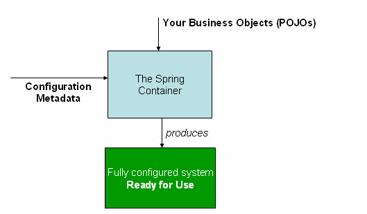

# Spring IOC 容器

*由上图可见， IOC容器的作用  通过某种方式加载Configuration Metadata(XML) 根据这些信息绑定整个系统的对象 最终被组装成一个可用的基于轻量级容器的应用系统*

*IOC容器实现以上功能可以按照流程划分为两个阶段 : 容器启动阶段    Bean实例化阶段*

>1. 容器启动阶段 : 通过某种途径加载Configuration Metadata  一般需要依赖某些工具类(BeanDefinitionReader)对加载的Metadata进行解析和分析 将分析后的信息编组为响应的BeanDefinition  最后把这些保存了Bean定义信息的BeanDefinition注册到相应的BeanDefinitionRegistry 这样容器启动工作就完成了. 这阶段所做的工作可以认为是准备性的 更加侧重于对象管理信息的收集
>2. Bean的实例化阶段 : 容器会首先检查所请求的对象之前是否已经初始化 如果没有 会根据注册的BeanDefinition所提供的信息实例化被请求对象 并为其注入依赖. 如果该对象实现了某些回调接口 也会根据回调接口的要求来装配它. 当该对象装配完毕后 容器会立即返回请求放使用

## 了解Bean的一生

