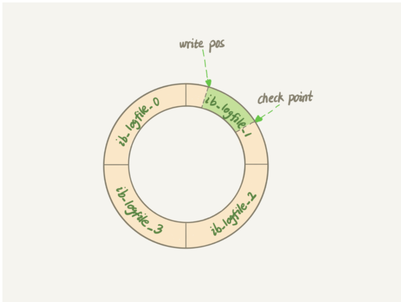

# MySQL

## 一条MySQL语句执行的步骤

> 1.客户端请求 -> 连接器
>
> 2.查询缓存(存在缓存则直接返回  不存在则执行后续操作)
>
> 3.分析器(对SQL进行词法分析和语法分析操作)
>
> 4.优化器(主要对执行的SQL优化选择最优的执行方案)
>
> 5.执行器 -> 去引擎层获取数据返回

## 索引的三种常见底层数据结构以及优缺点

> 三种常见索引底层结构 : 哈希表    有序数组    搜索树
>
> 哈希表:适用于等值查询 不适合范围查找
>
> 有序数组:适用于静态存储引擎  等值和范围查找性能好 但是更新数据成本高
>
> N叉树

## 索引的常见类型以及如何发挥作用

> 根据叶子节点的内容 索引类型分为   主键索引    和   非主键索引
>
> 1.主键索引的叶子节点 存的整行数据  在InnoDB里被称为聚簇索引
>
> 2.非主键索引叶子节点  存的主键的值  在InnoDB里称为二级索引

## MyISAM和InnoDB实现B树索引方式的区别是什么

> InnoDB存储引擎 : B+树索引的叶子节点保存数据本身  其数据文件本身就是索引文件
>
> MyISAM存储引擎 : B+树索引的叶子节点保存数据的物理地址 叶节点的data域存放的是数据记录的地址 索引文件和数据是分离的

## 什么是覆盖索引和索引下推

> 覆盖索引 : 在某个查询里 索引 K 已经覆盖了我们的查询要求  
>
> 索引下推 : 可以在索引遍历过程中  对索引中包含的字段优先做判断  直接过滤掉不满足条件的记录 减少回表次数

## MySQL的 change buffer是什么

> 当需要更新一个数据页时,如果数据页在内存中就直接更新;而如果这个数据页还没有在内存中的话,在不影响数据一致性的前提下,InnoDB会将这些操作缓存在 change buffer中
>
> 这样就不需要从磁盘读入这些数据页了 在下次查询需要访问这个数据页的时候 将数据页读入内存  然后执行change buffer中与这个页有关的操作  通过这种方式能保证这个数据逻辑的正确性
>
> 唯一索引的更新不能使用change buffer 只有普通索引可以使用

## MySQL如何判断一行扫描数

> MySQL在真正开始执行语句之前 并不能准确的知道满足这个条件的记录有多少条 只能根据统计信息来估算 这个统计信息就是索引的  区分度

## MySQL redo log 和 bin log

|                | redo log                                      | binlog                                                       |
| -------------- | --------------------------------------------- | ------------------------------------------------------------ |
| 作用           | 用于崩溃恢复                                  | 主从复制和数据恢复                                           |
| 实现方式       | Innodb存储引擎实现                            | Server层实现 所有的存储引擎都可以使用binlog                  |
| 记录方式       | 循环写的方式记录 写到结尾时, 会回头循环写日志 | 通过追加的方式记录 当文件尺寸大于配置值后   ,后续日志会记录在新的文件上 |
| 文件大小       | redo log大小固定                              | 通过配置指定                                                 |
| crash-safe能力 | 具有                                          | 没有                                                         |
| 日志类型       | 逻辑日志                                      | 物理日志                                                     |

## 为什么需要redo log

> redo log主要用于MySQL异常重启后的一种数据恢复手段 确保数据一致性
>
> MySQL进行更新操作 为了能够快速响应 采用了异步写回磁盘的技术 写入内存后就返回 .但是这样 会存在crash后内存数据丢失的隐患 而 redo log具备crash-safe的能力

## 为什么 redo log具有crash-safe的能力  是binlog无法替代的

> redo log可以确保InnoDB判断哪些数据已经刷盘 哪些数据还没有
>
> redo log和binlog有一个很大的区别是  redolog循环写 binlog追加写  也就是说redo log只会记录未刷盘的日志 已经刷入磁盘的数据都会从redo log这个有限大小的日志文件里删除   binlog是追加日志 保存全量日志
>
> 当数据库crash后  想要恢复未刷盘但是已经写入redo log 和 binlog的数据到内存时, binlog是无法恢复的.因为binlog无法让InnoDB判断哪些已经刷盘 哪些还没有
>
> 如果redo log写入失败  说明此次操作失败 事务也不可能提交

## 当数据库crash后 如何恢复未刷盘的数据到内存

> 根据redo log 和binlog的两阶段提交  未持久化的数据分为几种情况
>
> 1.change buffer 写入  redo log虽然做了fsync 但未commit, binlog未fsync到磁盘 这部分数据丢失
>
> 2.change buffer写入  redo log fsync未commit, binlog 已经fsync到磁盘 先从binlog 恢复 redo log 再从redo log恢复 change buffer
>
> 3.change buffer写入 redo log 和 binlog 都fsync  直接从redolog恢复

## redo log写入方式

> redo log包括两部分内容  内存中的日志缓冲   和   磁盘上的日志文件
>
> MySQL每执行一条DML语句  会先把记录写入 redo log buffer(用户空间)  再保存到内核空间的缓冲区OS-buffer中  后续某个时间点再一次性多个操作记录到redo log file(刷盘)  这种先写日志,再写磁盘的技术 就是WAL
>
> redo log buffer写到 redo log file  是经过OS buffer中转的  
>
> 0: 延迟写; 1:实时写; 2:实时写 延迟刷

## redo log执行流程

> 1.MySQL客户端将请求语句发往MySQL Server层
>
> 2.接到SQL请求后  对其进行 分析 优化 执行等处理工作  将生成的SQL执行计划发到InnoDB存储引擎层中执行
>
> 3.InnoDB存储引擎将修改操作记录到内存中
>
> 4.记录到内存以后会修改redo log日志 添加一行记录 内容是 需要在哪个数据页上做什么修改
>
> 5.此后  将事务的状态设置为 prepare 说明已经准备好提交事务了
>
> 6.等到MySQL Server层处理完事务后 将事务状态设置为commit  也就是提交该事务
>
> 7.在收到事务提交请求以后,redo log会把刚才写入内存中的操作记录写入到磁盘 从而完成整个日志的记录过程

## binlog是什么 起到什么作用 

> binlog是归档日志 属于MySQL Server层的日志   可以实现 主从复制 和 数据恢复
>
> 当需要恢复数据时  可以取出某个时间范围内的binlog进行重放恢复
>
> binlog不可以做crash safe  因为 crash之前 binlog可能没有写入完全 mysql就挂了 需要配合redo log才可以进行crash safe

## 什么是两阶段提交

> MySQL将redo log的写入拆成两个步骤 : prepare 和 commit  中间再穿插写入binlog
>
> 执行器想要更新记录R -> InnoDB将记录R加载进Buffer Pool -> 将记录R旧值写入 undo log便于回滚 -> 执行器更新内存中的数据(此时该数据页为脏页) -> 执行器写 redo log(prepare) -> 执行器写binlog -> 执行器写 redo log(commit)

## MySQL怎么知道binlog是完整的

> 一个事务的binlog是有完整格式的:
>
> statement格式的binlog, 最后会有commit;
>
> row格式的binlog 最后会有一个XID event

## 什么是WAL技术  有什么有点

> Write-Ahead Logging  它的关键点就是日志先写内存 再写磁盘. MySQL执行更新操作后,在真正把数据写入到磁盘前 先记录日志
>
> 好处 : 不用每一次操作都实时把数据写盘 就算crash后也可以通过 redo log恢复  所以能够实现快速响应SQL语句

## binlog日志三种格式

> statement : 基于SQL语句的复制
>
> row : 基于行的复制
>
> mixed : 混合模式复制

> statement : 
>
> 每一条修改数据的SQL都会记录在binlog中
>
> 优点 : 不需要记录每一行的变化  减少binlog日志量  节约IO 提高性能
>
> 缺点 : 由于记录的只是执行语句, 为了这些语句能在备库上正确运行, 还必须记录每条语句在执行的时候一些相关信息, 以确保所有语句能在备库上得到和主库端执行时候相同的结果

>row:
>
>不记录SQL语句上下文相关信息  仅保存哪条记录被修改
>
>优点 : binlog中可以不记录执行的SQL语句的上下文相关的信息, 仅需要记录哪一条记录被修改成什么. 所以rowlevel的日志内容会非常清楚地记录下每一行数据修改的细节. 不会出现某些特定情况下的存储过程 function或trigger的调用和触发无法被正确复制的问题
>
>缺点 : 可能会产生大量的日志内容

> mixed : 
>
> statement与row的结合. 一般的语句用statement保存binlog.一些函数采用row格式保存binlog.

## redo log日志格式

> redo log buffer 是由首尾相连的四个文件组成的  分别是 ib_logfile_1; ib_logfile_2;ib_logfile_3;ib_logfile_4
>
> * write pos是当前记录的位置. 一边写一边往后移, 写到第三号文件末尾后就回到0号文件开头
> * checkpoint 是当前要擦除的位置, 也是往后推移并循环的  擦除记录前要把记录更新到数据文件
> * write pos 和 checkpoint之间 可以用来记录新的操作
> * 如果write pos追上checkpoint 表示"粉板"满了, 这时候不能再执行新的更新,得停下来擦掉一些记录, 把checkpoint推进一下
> * 有了redo log, 当数据库发生宕机重启后, 可通过 redo log将未落盘的数据恢复, 保证已经提交的事务记录不会丢失  这种能力称为crash-safe

## 原本可以执行得很快的SQL语句 执行速度却比预期的慢很多 原因是什么 如何解决

> 原因:
>
> 1.MySQL数据库本身被堵住了  比如 : 系统或网络资源不够
>
> 2.SQL语句被堵住了 比如 : 表锁. 行锁等  导致存储引擎不执行对应的SQL语句
>
> 3.确实是索引使用不当  没有走索引
>
> 4.表中数据的特点导致的, 走了索引  但是回表次数庞大

> 解决:
>
> 1.考虑采用 force index强行选择一个索引
>
> 2.考虑修改SQL语句  引导MySQL使用我们期望的索引
>
> 3.在有些场景下 可以新建一个更适合的索引  来提供给优化器做选择 或删掉误用的索引
>
> 4.如果确定索引没必要 可以考虑删除索引

## InnoDB数据页结构

> 1.File Header  表示页的一些通用信息  占固定38字节
>
> 2.page Header  表示数据页专有信息  占固定56字节
>
> 3.inimum+Supermum  两个虚拟的伪记录  分别表示页中最小记录和最大记录 占固定26字节
>
> 4.User Records  真正存储我们插入的数据  大小不固定
>
> 5.Free Space  页中尚未使用的部分  大小不固定
>
> 6.Page Directory  页中某些记录的相对位置  也就是各个槽对应的记录在页面中的地址偏移量
>
> 7.File Trailer  用于检验页是否完整  8字节

## 如何理解MySQL的边读边发

> 如果客户端接收慢 会导致MySQL服务端由于结果发不出去 这个事务执行时间会很长
>
> 服务端并不需要保存一个完整的结果集  取数据和发数据的流程都是通过一个next_buffer来操作的
>
> 内存的数据页都是保存在buffer_pool中操作的
>
> InnoDB管理buffer_pool使用的是改进的LRU算法 使用链表实现  实际上  按照5:3的比例把整个LRU链表分成了young区域和old区域

## MySQL的大表查询为什么不会爆内存

> 由于MySQL是边读边发  因此对于数据量很大的查询结果来说  不会在server端保存完整的结果集. 所以 如果客户端读结果不及时 会堵住MySQL的查询过程  但不会把内存打爆
>
> InnoDB引擎内部  由于有淘汰策略. InnoDB管理Buffer_pool使用的是改进的LRU算法  使用链表实现  对冷数据的全表扫描 影响也能做到可控制

## MySQL是如何保证主备同步的

> 主备关系的建立:
>
> 一开始创建主备关系的时候  是由备库指定的  比如基于位点的主备关系  备库说"我要从binlog文件A的位置P"开始同步 主库就从这个指定的位置开始往后发;
>
> 而备库关系搭建之后, 是主库决定要发给数据给备库的, 所以主库有新的日志也会发给备库

> 主备切换流程
>
> 客户端读写都是直接访问A  而节点B是备库, 只要将A的更新都同步过来 到本地执行就可以保证数据是相同的
>
> 当需要切换的时候就把节点换一下

> 一个事务完整的同步流程
>
> 备库B和主库A建立了长连接  主库A内部专门线程用于维护这个长链接
>
> 在备库B上通过changemaster命令设置主库A的ip端口用户名密码及从哪个位置开始请求binlog包括文件名和日志偏移量
>
> 在备库B上执行start-slave命令  备库会启动两个线程 : io_thread和sql_thread分别负责建立连接和读取中转日志进行解析执行
>
> 备库读取主库传过来的binlog文件  写到本地成为中转日志

## MySQL并行策略

> 按表分发策略
>
> 如果两个事务更新不同的表, 它们就可以并行. 因为数据存储在表里,所以按表分发  可以保证两个worker不会更新同一行
>
> 但是如果碰到热点表,比如所有的更新事务都会涉及到某一个表的时候  所有事务都会分配到同一个worker中 就变成单线程复制了

> 按行分发策略
>
> 如果两个事务没有更新相同的行  它们在备库上可以并行.   这个模式要求binlog格式必须是row
>
> 相比于按表分发策略 按行并行策略在决定线程分发的时候 需要消耗更多的计算资源

