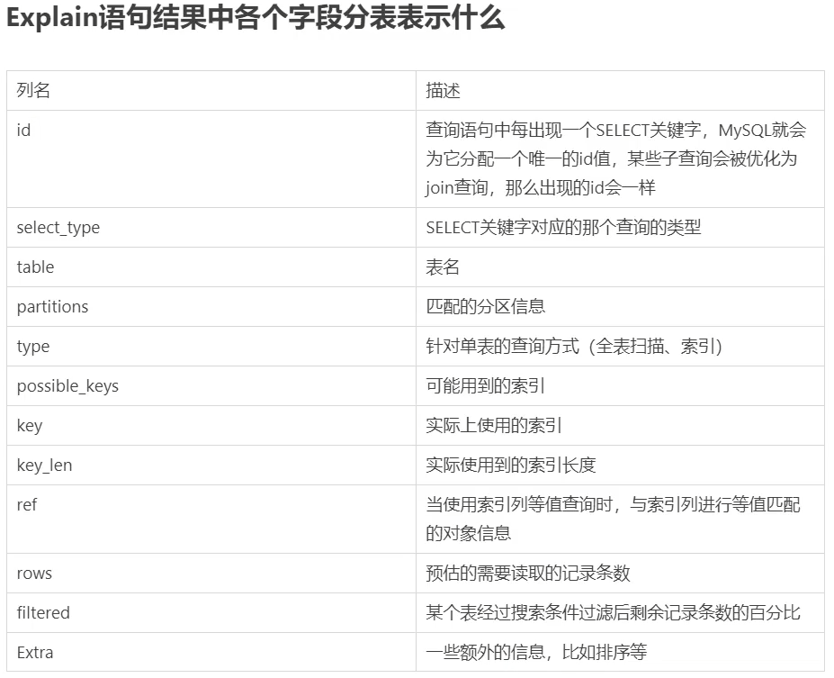

## SQL

### 隔离级别

- READ UNCOMMITTED(未提交读)
- ``` 事务中的修改 即使没有提交 对其他事务也都是可见的  事务可以读取未提交的数据 (脏读)```

- READ COMMITTED(提交读)
- ``` 大多数数据库默认隔离级别(Mysql不是) 一个事务开始时 只能看见已经提交的事务所做的修改  换句话说 一个事务从开始直到提交之前 所做的任何修改对其他事务是不可见的  也叫作 不可重复读 因为两次执行同样的查询 可能会得到不一样的结果```

- REPEATABLE READ(可重复读)
- ``` Mysql默认隔离级别 解决脏读问题  保证了在同一事务中多次读取同样记录的结果是一致的  但是无法解决 幻读 问题  幻读指的是 当某个事务在读取某个范围内的记录时 另外一个事务又在该范围内插入了新的记录 当之前事务再次读取该范围的记录时, 会产生幻行  InnoDB通过多版本并发控制(MVCC)解决幻读问题```

- SERIALIZABLE(串行化)
- ``` 强制事务串行执行 避免幻读  会在读取每一行数据上都加锁```

|隔离级别           |脏读可能性|不可重复读可能性|幻读可能性|加读锁
|READ UNCOMMITTED | yes     | yes         | yes    | no
|READ COMMITTED   | no      | yes         | yes    | no
|REPEATABLE READ  | no      | no          | yes    | no
|SERIALIZABLE     | no      | no          | no     | yes




### 索引覆盖是什么
> 索引覆盖 就是一个SQL在执行时 可以利用索引来快速查找 并且此SQL索要查询的字段在当前索引对应的字段中都包含了  那么就表示此SQL走完索引后不再回表了 所需要的字段都在当前索引叶子结点上存在  可以直接作为结果返回了
> 

### 最左前缀原则
> 当一个SQL想要利用索引时  就一定要提供该索引所对应的字段中最左边的字段 也就是排在最前面的字段
> 比如针对a b c三个字段建立了一个联合索引 那么在写一个sql时就一定要提供a字段的条件 这样才能利用联合索引
> 这是由于在建立  a  b  c三个字段的联合索引时  底层的B+树是按照 a b c三个字段从左往右去比较大小进行排序的 所以如果想要利用B+树进行快速查找也得符合这个规则
> 

### Innodb是如何实现事务的
> InnoDB通过 Buffer Pool,  LogBuffer,  Redo Log,  Undo Log来实现事务 以update语句为例
> 1.InnoDB在收到一个update语句后 会先根据条件找到数据所在的页  并将该页缓存在Buffer Pool中
> 2.执行update语句 修改 Buffer Pool中的数据  也就是内存中的数据
> 3.针对update语句生成一个RedoLog对象 并存入LogBuffer中
> 4.针对update语句生成UndoLog日志 用于事务回滚
> 5.如果事务提交 那么将RedoLog对象进行持久化  后续还有其他机制将Buffer Pool中所修改的数据页持久化到磁盘中
> 6.如果事务回滚 则利用UndoLog日志进行回滚
> 
### B树和B+树的区别 为什么Mysql使用B+树
> B树 : 1.节点排序  2.一个节点可以存多个元素 多个元素也排序了
> B+树 : 拥有B树的特点  2.叶子节点之间有指针  3.非叶子节点上的元素在叶子结点上都冗余了 也就是叶子节点中存储了所有元素 并且排好序了
> Mysql索引用的是B+树 因为索引是用来加快查询的  而B+树通过对数据进行排序 所以可以提高查询速度  然后通过一个节点可以存储多个元素 从而使得B+树的高度不会太高  
> 在Mysql中一个InnoDB页就是一个B+树节点 一个InnoDB页默认16Kb 所以一般情况下 一颗两层B+树可以存2000万行左右的数据 然后通过利用B+树叶子节点存储了所有数据并进行了排序 且叶子节点之间有指针  可以很好的支持全表扫描 范围查找等SQL
> 
### Mysql锁有哪些
> 按锁的粒度:  1.行锁   2.表锁   3.间隙锁
> 还可以分为  共享锁  排它锁
> 还可以分为 乐观锁  悲观锁
> 利用锁来解决幻读问题